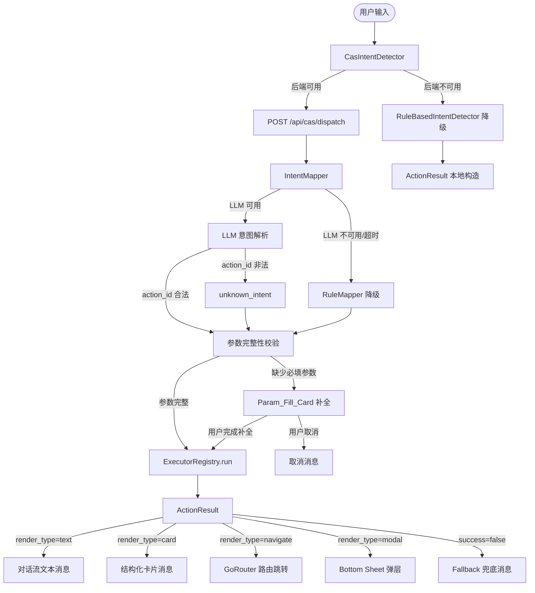

# 设计文档：受控动作空间（Controlled Action Space）框架

## 概述

受控动作空间（CAS）框架是学习助手 APP 的核心交互基础设施，将系统所有合法行为预先枚举为一个有限、闭合、完备的集合。其设计哲学来源于「崩铁帕姆一键配遗器」和「编程猫积木系统」：用户只能在这个集合内选择，系统永远不会因为用户输入而崩溃、报错或越界。

CAS 框架分三层：
- **Action 层**：YAML 定义所有能力，`action_id`（snake_case）唯一标识
- **Param 层**：6 种参数类型（radio / checkbox / number / text / date / topic_tree），缺参时弹出补全卡片
- **Executor 层**：每个 Action 对应一个执行函数，必捕获异常，返回固定结构 `ActionResult`

LLM 在 CAS 框架中只承担一件事：把用户的自然语言输入映射到 Action + 参数，不生成逻辑，不执行逻辑。

---

## 架构

### 整体数据流



### 后端模块结构

```
backend/
├── cas/
│   ├── __init__.py
│   ├── action_registry.py      # ActionRegistry 单例（复用 SkillRegistry 模式）
│   ├── executor_registry.py    # ExecutorRegistry + @register_executor 装饰器
│   ├── intent_mapper.py        # IntentMapper（LLM + RuleMapper 双路）
│   ├── dispatch_pipeline.py    # DispatchPipeline 编排器
│   ├── models.py               # Pydantic 模型（ActionResult、IntentMapResult 等）
│   └── executors/
│       ├── __init__.py
│       ├── make_quiz.py
│       ├── make_plan.py
│       ├── open_calendar.py
│       ├── add_calendar_event.py
│       ├── recommend_mistake_practice.py
│       ├── open_notebook.py
│       ├── explain_concept.py
│       ├── solve_problem.py
│       └── unknown_intent.py
├── prompts/
│   └── actions/
│       └── builtin.yaml        # 所有内置 Action 定义
└── routers/
    └── cas.py                  # CAS_Router（/api/cas）
```

### 前端模块结构

```
lib/
├── features/cas/
│   ├── cas_service.dart            # HTTP 客户端（封装 /api/cas/*）
│   ├── cas_dispatch_provider.dart  # CasDispatchProvider（Riverpod）
│   ├── cas_intent_detector.dart    # CasIntentDetector（实现 IntentDetector 接口）
│   └── models/
│       └── action_result.dart      # ActionResult Dart 模型
└── widgets/
    └── param_fill_card.dart        # ParamFillCard Widget（复用 SceneCard 样式）
```

---

## 组件与接口

### 后端：ActionRegistry

复用 `SkillRegistry` 的单例 + 懒加载模式，从 `backend/prompts/actions/builtin.yaml` 加载。

```python
class ActionRegistry:
    """单例 Action 注册表，从 YAML 懒加载，支持 reload()。"""

    def get_action(self, action_id: str) -> Optional[ActionDef]: ...
    def list_actions(self) -> list[ActionDef]: ...
    def summaries(self) -> str: ...          # 供 LLM 提示词使用
    def reload(self) -> None: ...

def get_action_registry() -> ActionRegistry: ...  # 模块级单例访问
```

加载时对每个 Action 进行校验：
- 必须包含 `action_id`、`name`、`description`、`param_schema`、`executor_ref` 五个字段
- `param_schema` 中所有参数类型必须属于 6 种合法 `Param_Type`
- `executor_ref` 对应的 Executor 函数必须已注册
- 校验失败的 Action 被跳过并记录 `WARNING` 日志，不阻断其他 Action 加载

### 后端：ExecutorRegistry

```python
_executor_registry: dict[str, Callable] = {}

def register_executor(action_id: str):
    """装饰器：将函数注册为指定 action_id 的 Executor。"""
    def decorator(fn: Callable) -> Callable:
        _executor_registry[action_id] = fn
        return fn
    return decorator

def get_executor(action_id: str) -> Optional[Callable]: ...

# 使用示例
@register_executor("make_quiz")
async def make_quiz_executor(params: dict, user_id: int) -> ActionResult:
    ...
```

### 后端：IntentMapper

```python
class IntentMapper:
    """LLM 意图映射，失败时自动降级为 RuleMapper。"""

    async def map(
        self,
        text: str,
        session_id: Optional[str] = None,
        timeout_seconds: float = 3.0,
    ) -> IntentMapResult: ...

class RuleMapper:
    """基于关键词的本地规则映射，不依赖 LLM。"""

    def map(self, text: str) -> IntentMapResult: ...
```

`IntentMapResult` 结构：
```python
class IntentMapResult(BaseModel):
    action_id: str
    params: dict[str, Any] = {}
    confidence: float          # LLM 映射时由模型提供，Rule 降级时固定 0.5
    degraded: bool = False     # 是否走了降级路径
```

### 后端：DispatchPipeline

```python
class DispatchPipeline:
    """从用户输入到 ActionResult 的完整处理链路。"""

    async def run(
        self,
        text: str,
        session_id: Optional[str],
        user_id: int,
    ) -> ActionResult: ...

    def _validate_params(
        self,
        action: ActionDef,
        params: dict,
    ) -> tuple[bool, list[str]]: ...  # (is_complete, missing_required_params)
```

### 后端：CAS Router

```python
router = APIRouter()

@router.get("/actions")
def list_actions() -> ActionsListOut: ...

@router.post("/dispatch")
async def dispatch(body: DispatchIn, user=Depends(get_current_user)) -> ActionResult: ...
```

### 前端：CasService

```dart
class CasService {
  Future<ActionResult> dispatch(String text, {String? sessionId});
  Future<List<ActionSummary>> listActions();
}
```

### 前端：CasDispatchProvider

```dart
class CasDispatchState {
  final bool isLoading;
  final ActionResult? lastResult;
  final List<ParamRequest>? pendingParams;  // 非空时触发 ParamFillCard
}

final casDispatchProvider = StateNotifierProvider<CasDispatchNotifier, CasDispatchState>(...);
```

### 前端：CasIntentDetector

实现现有 `IntentDetector` 抽象类接口，优先调用后端，降级时复用 `RuleBasedIntentDetector`：

```dart
class CasIntentDetector implements IntentDetector {
  final CasService _casService;
  final RuleBasedIntentDetector _fallback = RuleBasedIntentDetector();

  @override
  Future<DetectedIntent> detect(String userInput, {List<Subject>? subjects}) async {
    try {
      final result = await _casService.dispatch(userInput).timeout(
        const Duration(seconds: 10),
      );
      return _toDetectedIntent(result);
    } catch (_) {
      return _fallback.detect(userInput, subjects: subjects);
    }
  }
}
```

### 前端：ParamFillCard

复用 `SceneCard` 的视觉样式（圆角卡片、左侧彩色竖条、主题色按钮），根据 `Param_Type` 渲染不同的输入控件：

```dart
class ParamFillCard extends ConsumerWidget {
  final ParamRequest param;       // 当前需要补全的参数
  final ValueChanged<dynamic> onFilled;
  final VoidCallback onCancel;
  // ...
}
```

---

## 数据模型

### YAML Action 定义格式

```yaml
# backend/prompts/actions/builtin.yaml
actions:
  - action_id: make_quiz
    version: "1.0.0"
    name: 出题
    description: 根据指定学科和题型生成练习题
    fallback_text: 出题服务暂时不可用，请稍后再试
    param_schema:
      - name: subject
        type: radio
        label: 选择学科
        required: true
        options: []          # 运行时从用户学科列表动态填充
        dynamic_source: user_subjects
      - name: question_type
        type: checkbox
        label: 题型
        required: true
        options: ["选择题", "填空题", "解答题"]
      - name: count
        type: number
        label: 题目数量
        required: true
        min: 1
        max: 20
        step: 1
        default: 5
    executor_ref: make_quiz

  - action_id: unknown_intent
    version: "1.0.0"
    name: 未知意图
    description: 用户意图无法识别时的兜底 Action
    fallback_text: 暂时无法理解您的请求，请换一种方式描述
    param_schema: []
    executor_ref: unknown_intent
```

### Pydantic 模型（后端）

```python
class ParamType(str, Enum):
    radio      = "radio"
    checkbox   = "checkbox"
    number     = "number"
    text       = "text"
    date       = "date"
    topic_tree = "topic_tree"

class ParamDef(BaseModel):
    name: str
    type: ParamType
    label: str
    required: bool = True
    default: Optional[Any] = None
    # radio / checkbox
    options: Optional[list[str]] = None
    dynamic_source: Optional[str] = None   # "user_subjects" 等
    # number
    min: Optional[float] = None
    max: Optional[float] = None
    step: Optional[float] = None
    # text
    max_length: int = 200
    # date
    min_date: Optional[str] = None
    max_date: Optional[str] = None

class ActionDef(BaseModel):
    action_id: str
    version: str = "1.0.0"
    name: str
    description: str
    fallback_text: str
    param_schema: list[ParamDef]
    executor_ref: str

class ActionResult(BaseModel):
    success: bool
    action_id: str
    data: dict[str, Any] = {}
    error_code: Optional[str] = None
    error_message: Optional[str] = None
    fallback_used: bool = False
    # data 中必须包含 render_type: "text" | "card" | "navigate" | "modal"

class RenderType(str, Enum):
    text     = "text"
    card     = "card"
    navigate = "navigate"
    modal    = "modal"
```

### Dart 模型（前端）

```dart
enum RenderType { text, card, navigate, modal }

class ActionResult {
  final bool success;
  final String actionId;
  final Map<String, dynamic> data;
  final String? errorCode;
  final String? errorMessage;
  final bool fallbackUsed;

  RenderType get renderType =>
      RenderType.values.firstWhere(
        (e) => e.name == (data['render_type'] as String? ?? 'text'),
        orElse: () => RenderType.text,
      );

  factory ActionResult.fromJson(Map<String, dynamic> json) { ... }

  /// 网络失败时的本地兜底构造
  factory ActionResult.localFallback({String? message}) => ActionResult(
    success: false,
    actionId: 'system_error',
    data: {
      'render_type': 'text',
      'text': message ?? '服务暂时不可用，请稍后再试',
    },
    fallbackUsed: true,
  );
}
```

---

## Dispatch Pipeline 详细流程

### 正常路径

```
1. 前端 CasIntentDetector.detect(text)
   └─ 调用 POST /api/cas/dispatch { text, session_id }

2. 后端 DispatchPipeline.run(text, session_id, user_id)
   ├─ 2.1 IntentMapper.map(text, timeout=3s)
   │       ├─ 构建 LLM 提示词（包含 ActionRegistry.summaries()）
   │       ├─ 调用 LLM，解析 JSON 返回 { action_id, params, confidence }
   │       └─ 验证 action_id 存在于 ActionRegistry，否则返回 unknown_intent
   │
   ├─ 2.2 参数完整性校验
   │       ├─ 获取 ActionDef.param_schema
   │       ├─ 检查所有 required=true 的参数是否已在 params 中
   │       └─ 返回 (is_complete, missing_params)
   │
   ├─ 2.3 [参数完整] 调用 ExecutorRegistry.get_executor(action_id)(params, user_id)
   │       └─ 返回 ActionResult
   │
   └─ 2.4 [参数不完整] 返回特殊 ActionResult
           data = {
             render_type: "param_fill",
             action_id: "...",
             missing_params: [...],
             collected_params: {...}
           }

3. 前端收到 ActionResult
   ├─ render_type=param_fill → CasDispatchProvider 设置 pendingParams
   │   └─ ParamFillCard 逐一展示缺失参数
   │       ├─ 用户填写 → 追加到 collected_params
   │       ├─ 所有必填参数完成 → 重新调用 dispatch（携带完整 params）
   │       └─ 用户取消 → 清空 pendingParams，插入「已取消」消息
   │
   ├─ render_type=text    → 对话流插入文本消息
   ├─ render_type=card    → 对话流插入结构化卡片
   ├─ render_type=navigate → GoRouter.push(data['route'])
   └─ render_type=modal   → showModalBottomSheet(content=data['content'])
```

### 异常路径

```
IntentMapper 超时（>3s）
  └─ 自动降级为 RuleMapper，confidence=0.5，degraded=true

LLM 返回非法 JSON
  └─ 捕获 JSONDecodeError → 降级为 RuleMapper

LLM 返回不存在的 action_id
  └─ 丢弃结果 → 返回 unknown_intent

Executor 抛出任意异常
  └─ 捕获 → 返回 ActionResult(success=False, fallback_used=True,
              data={render_type:"text", text: action.fallback_text})

Pipeline 任意环节未捕获异常
  └─ DispatchPipeline 顶层 try/except → 返回 system_error ActionResult
     HTTP 响应始终为 200（空字符串输入除外，返回 400）

前端网络请求失败 / HTTP 5xx
  └─ CasService catch → ActionResult.localFallback()

前端 ActionResult 字段缺失
  └─ ActionResult.fromJson 用默认值填充，不抛出解析异常

前端请求超时（>10s）
  └─ timeout() catch → ActionResult.localFallback(message: '请求超时，请稍后再试')
```

---

## 正确性属性

*属性（Property）是在系统所有合法执行中都应成立的特征或行为——本质上是对系统应该做什么的形式化陈述。属性是人类可读规范与机器可验证正确性保证之间的桥梁。*

### 属性 1：ActionRegistry 查询封闭性

*对任意* 字符串 `action_id`，`ActionRegistry.get_action(action_id)` 要么返回注册表中对应的 `ActionDef`，要么返回 `None`，永远不抛出异常。

**验证：需求 1.4**

---

### 属性 2：Action 注册完整性

*对任意* 合法的 Action YAML 条目（包含所有必要字段且 `param_schema` 中参数类型均合法），将其写入 YAML 文件并调用 `reload()` 后，`get_action(action_id)` 应返回该 Action，且 `list_actions()` 的长度应增加 1。

**验证：需求 1.3、10.1**

---

### 属性 3：非法参数类型被拒绝

*对任意* 包含非法 `param_type`（不属于 6 种合法类型）的 Action 定义，`ActionRegistry` 加载后该 Action 不应出现在 `list_actions()` 的结果中，且不影响其他合法 Action 的加载。

**验证：需求 1.6、2.7**

---

### 属性 4：摘要列表与注册表一致

*对任意* 包含 N 个合法 Action 的注册表，`list_actions()` 返回的列表长度应等于 N，且每个元素都包含 `action_id`、`name`、`description` 三个字段。

**验证：需求 1.5**

---

### 属性 5：意图映射结果合法性

*对任意* 非空用户输入字符串，`IntentMapper.map()` 返回的 `IntentMapResult.action_id` 必须存在于 `ActionRegistry` 中，且 `confidence` 值在 `[0.0, 1.0]` 范围内，不抛出异常。

**验证：需求 3.1、3.5**

---

### 属性 6：LLM 非法返回的降级不变性

*对任意* 随机字符串（包括非 JSON 格式、包含不存在 `action_id` 的 JSON）作为 LLM 的模拟返回值，`IntentMapper` 应返回合法的 `IntentMapResult`（`action_id` 存在于注册表中），不传播任何异常。

**验证：需求 3.3、3.4**

---

### 属性 7：Executor 异常隔离

*对任意* Executor 函数，当其内部抛出任意类型的异常时，`ExecutorRegistry.run()` 应返回 `ActionResult(success=False, fallback_used=True)`，且 `data` 中包含 `render_type` 字段，不向调用方传播异常。

**验证：需求 5.2、5.3、5.4**

---

### 属性 8：ActionResult 字段完整性

*对任意* Executor 的执行结果，返回的 `ActionResult` 必须包含 `success`、`action_id`、`data`、`fallback_used` 四个字段，且 `data` 中必须包含 `render_type` 字段，其值属于 `{text, card, navigate, modal}` 之一。

**验证：需求 5.1、5.4**

---

### 属性 9：Dispatch 端点 HTTP 200 不变性

*对任意* 非空用户输入字符串，`POST /api/cas/dispatch` 端点应始终返回 HTTP 200，错误信息通过 `ActionResult.success=False` 传递，不返回 HTTP 4xx/5xx。

**验证：需求 6.8**

---

### 属性 10：前端 ActionResult 解析健壮性

*对任意* 缺少部分字段的 `ActionResult` JSON（随机删除非必须字段），`ActionResult.fromJson()` 应成功解析并用默认值填充缺失字段，不抛出解析异常，且 `renderType` 始终返回合法的 `RenderType` 枚举值。

**验证：需求 9.3**

---

### 属性 11：参数完整性校验单调性

*对任意* `ActionDef` 和参数字典 `params`，若 `_validate_params(action, params)` 返回 `(True, [])`（参数完整），则在 `params` 中追加任意额外键值对后，校验结果仍应为 `(True, [])`（额外参数不影响完整性判断）。

**验证：需求 4.1、4.9**

---

## 错误处理

### 错误码体系

| `error_code` | 含义 | 前端展示 |
|---|---|---|
| `unknown_intent` | 意图无法识别 | 引导用户澄清 |
| `missing_params` | 缺少必填参数 | 触发 ParamFillCard |
| `executor_error` | Executor 执行失败 | 显示 `fallback_text` |
| `llm_unavailable` | LLM 服务不可用 | 已降级，透明处理 |
| `system_error` | Pipeline 未捕获异常 | 「系统繁忙，请稍后再试」 |
| `timeout` | 请求超时 | 「请求超时，请稍后再试」 |

### 错误隔离层次

```
Layer 1: Executor 内部 try/except（捕获业务异常）
Layer 2: DispatchPipeline 顶层 try/except（捕获 Pipeline 异常）
Layer 3: CAS Router 异常处理（保证 HTTP 200）
Layer 4: 前端 CasService try/catch（捕获网络异常）
Layer 5: ActionResult.fromJson 默认值填充（捕获解析异常）
```

### 日志记录

每次 Dispatch 执行记录结构化日志：

```python
{
    "action_id": "make_quiz",
    "success": True,
    "duration_ms": 245,
    "fallback_used": False,
    "degraded": False,
    "error_code": None,
    "session_id": "abc123",
    "user_id": 42,
}
```

日志保留最近 1000 条（循环缓冲区），可通过 `GET /api/cas/logs` 查询（仅管理员）。

---

## 测试策略

### 单元测试（示例测试）

- `ActionRegistry` 加载失败时返回空注册表，不抛出异常
- `GET /api/cas/actions` 返回 200 和 actions 列表
- `POST /api/cas/dispatch` 空字符串返回 HTTP 400
- `IntentMapper` LLM 不可用时降级为 `RuleMapper`，`confidence=0.5`
- `DispatchPipeline` 超时（>3s）自动降级
- 各 `render_type` 的前端处理逻辑（text/card/navigate/modal）
- `ParamFillCard` 各参数类型的渲染（radio/checkbox/number/text/date/topic_tree）

### 属性测试（Hypothesis，Python 后端）

使用 [Hypothesis](https://hypothesis.readthedocs.io/) 库，每个属性测试最少运行 100 次。

```python
# 标注格式：Feature: controlled-action-space, Property {N}: {property_text}

from hypothesis import given, settings
from hypothesis import strategies as st

# Feature: controlled-action-space, Property 1: ActionRegistry 查询封闭性
@given(action_id=st.text())
@settings(max_examples=200)
def test_action_registry_query_never_raises(action_id):
    registry = get_action_registry()
    result = registry.get_action(action_id)
    assert result is None or isinstance(result, ActionDef)

# Feature: controlled-action-space, Property 5: 意图映射结果合法性
@given(text=st.text(min_size=1))
@settings(max_examples=100)
def test_intent_mapper_always_returns_valid_action_id(text):
    mapper = IntentMapper()
    result = asyncio.run(mapper.map(text))
    assert get_action_registry().get_action(result.action_id) is not None
    assert 0.0 <= result.confidence <= 1.0

# Feature: controlled-action-space, Property 7: Executor 异常隔离
@given(exception_type=st.sampled_from([RuntimeError, ValueError, TimeoutError, Exception]))
@settings(max_examples=100)
def test_executor_never_propagates_exception(exception_type):
    @register_executor("test_action")
    async def failing_executor(params, user_id):
        raise exception_type("模拟异常")
    result = asyncio.run(ExecutorRegistry.run("test_action", {}, user_id=1))
    assert result.success is False
    assert result.fallback_used is True
    assert "render_type" in result.data
```

### 集成测试

- 端到端 Dispatch Pipeline（真实 LLM 调用，少量示例）
- 9 个内置 Executor 的实际执行（Mock 外部依赖）
- 前端 `CasIntentDetector` 降级行为（Mock 后端不可用）

### 与现有测试的关系

CAS 框架的属性测试与现有 `backend/.hypothesis/` 目录下的测试共存，遵循相同的 Hypothesis 配置。
