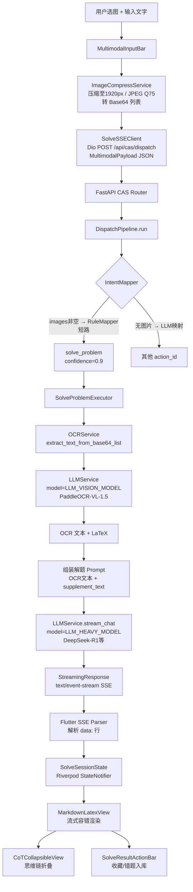
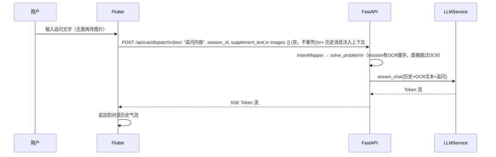
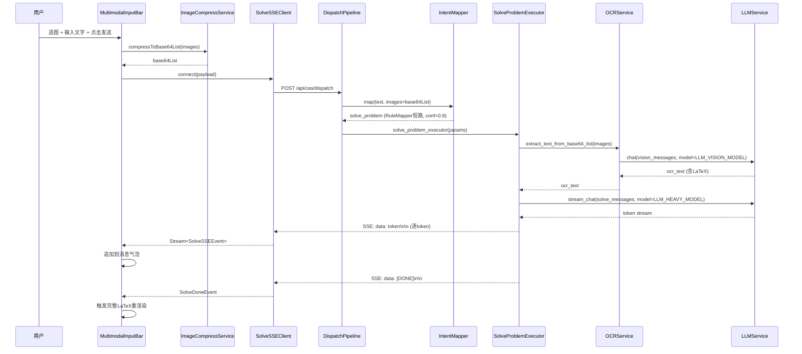

# 设计文档

## 概述

本文档描述"伴学"多模态解题系统的技术设计方案。核心思路是：在现有 CAS 意图调度架构上，以最小侵入性的方式扩展出一条专用的"图文解题"快速通道，复用已有的 `LLMService`、`Dio` 客户端和 FastAPI 路由，不引入不必要的新依赖。

---

## 技术选型决策

| 需求 | 选型 | 理由 |
|------|------|------|
| Flutter 图片压缩 | `flutter_image_compress ^2.3.0` | 原生插件，Android/iOS 均支持，API 简洁 |
| Flutter 图片全屏查看 | `photo_view ^0.15.0` | 业界标准，支持双指缩放和画廊模式 |
| Flutter SSE 客户端 | **复用已有 `dio`**，`responseType: ResponseType.stream` | `flutter_client_sse` 维护不活跃；dio 原生流式支持足够 |
| 后端 SSE 推送 | **FastAPI 原生 `StreamingResponse`** | 不引入 `sse-starlette`，项目已有 FastAPI |
| OCR API 调用 | **复用已有 `LLMService`** | SiliconFlow PaddleOCR-VL-1.5 完全兼容 OpenAI `/v1/chat/completions`，传入 `model=LLM_VISION_MODEL` 即可 |
| 后端异步 HTTP | **复用已有 `httpx`** | FastAPI 生态标配，无需新增 |

**新增 pubspec.yaml 依赖（仅 2 个）：**
```yaml
flutter_image_compress: ^2.3.0
photo_view: ^0.15.0
```

---

## 系统架构

### 完整数据流



### 追问数据流



---

## 组件设计

### 后端组件

#### 1. `backend/cas/models.py` — 模型扩展

```python
# DispatchIn 扩展（新增 images 和 supplement_text）
class DispatchIn(BaseModel):
    text: str = ""                          # 纯文字输入（可为空）
    session_id: Optional[str] = None
    images: Optional[list[str]] = None      # Base64 列表，最多 SOLVE_MAX_IMAGES 张
    supplement_text: Optional[str] = None   # 用户补充说明

# RenderType 新增流式类型
class RenderType(str, Enum):
    text       = "text"
    card       = "card"
    navigate   = "navigate"
    modal      = "modal"
    param_fill = "param_fill"
    stream     = "stream"   # 新增：标识此 action 返回 StreamingResponse
```

#### 2. `backend/cas/intent_mapper.py` — 多模态短路规则（含防御性豁免）

**防御性设计要点：**
- **短路豁免**：有图片时默认短路到 `solve_problem`，但若 `supplement_text` 包含其他明确系统动作词（日历/导图/笔记等），则取消短路，放行给 LLM Router 处理，避免误判

在 `RuleMapper.map()` 方法**最前面**插入优先规则：

```python
# 其他系统动作词：有这些词时即使有图片也不短路到 solve_problem
_NON_SOLVE_KEYWORDS = ["日历", "导图", "思维导图", "笔记", "计划", "出题", "错题", "讲义", "课程"]

def map(self, text: str, images: list[str] | None = None) -> IntentMapResult:
    # 优先规则：有图片时短路到解题意图
    # 豁免条件：text（supplement_text）包含其他明确系统动作词时，放行给 LLM Router
    if images:
        has_other_intent = any(kw in text for kw in _NON_SOLVE_KEYWORDS)
        if not has_other_intent:
            return IntentMapResult(
                action_id="solve_problem",
                params={"has_images": True},
                confidence=0.9,
                degraded=True,
            )
        # 有图片但包含其他动作词 → 继续走关键词规则，不短路
    # 原有关键词规则...
```

`IntentMapper.map()` 同步透传 `images` 和 `text` 参数给 `RuleMapper`。

#### 3. `backend/cas/dispatch_pipeline.py` — 流式路由

`DispatchPipeline.run()` 返回类型扩展为 `ActionResult | StreamingResponse`：

```python
async def run(
    self,
    text: str,
    session_id: str | None,
    user_id: int,
    images: list[str] | None = None,
    supplement_text: str | None = None,
) -> ActionResult | StreamingResponse:
    ...
    # 将 images 和 supplement_text 注入 intent.params
    # executor 若返回 StreamingResponse，直接透传
```

#### 4. `backend/services/ocr_service.py` — OCR 服务（新建/重构）

**防御性设计要点：**
- **并发限流**：使用 `asyncio.Semaphore(2)` 限制同时调用视觉 API 的并发数，防止触发 429 速率限制

```python
class OCRService:
    """
    高精度 OCR 服务。
    优先调用 PaddleOCR-VL-1.5（via LLMService），
    失败时降级到通用视觉 LLM，均失败抛 RuntimeError。
    """

    _OCR_PROMPT = (
        "提取图片中所有文本内容。"
        "若包含数学公式，严格使用标准 LaTeX 格式输出："
        "行内公式用 $...$，独立公式用 $$...$$。"
        "禁止输出任何解答、分析或额外说明，只输出原文。"
    )
    
    # 并发限流：最多同时 2 个视觉 API 请求，防止 429 速率限制
    _semaphore = asyncio.Semaphore(2)

    async def extract_text_from_base64(self, image_b64: str) -> str:
        """单张图片 OCR，返回识别文本。"""
        async with self._semaphore:
            # 调用 LLMService 的视觉接口
            messages = [
                {
                    "role": "user",
                    "content": [
                        {
                            "type": "image_url",
                            "image_url": {
                                "url": f"data:image/jpeg;base64,{image_b64}",
                                "detail": "high"
                            }
                        },
                        {"type": "text", "text": self._OCR_PROMPT}
                    ]
                }
            ]
            config = get_config()
            try:
                # 优先使用 PaddleOCR-VL-1.5
                result = await asyncio.wait_for(
                    LLMService().chat(messages, model=config.LLM_VISION_MODEL),
                    timeout=config.SOLVE_OCR_TIMEOUT_SECONDS
                )
                return result.strip()
            except (asyncio.TimeoutError, Exception) as e:
                logger.warning("OCR 主模型失败，降级到通用视觉: %s", e)
                # 降级到通用 LLM 视觉能力
                try:
                    result = await LLMService().chat(messages, model=config.LLM_CHAT_MODEL)
                    return result.strip()
                except Exception as fallback_err:
                    raise RuntimeError(f"OCR 服务不可用：{fallback_err}")

    async def extract_text_from_base64_list(self, images: list[str]) -> str:
        """多张图片 OCR，结果以 \\n---\\n 分隔拼接。"""
        results = await asyncio.gather(
            *[self.extract_text_from_base64(img) for img in images]
        )
        return "\n---\n".join(results)

    # ── 向后兼容，保留现有方法签名 ──────────────────────────────────────────
    def extract_text(self, image_path: str) -> str: ...
    def extract_text_from_pdf_page(self, pdf_path: str, page_num: int) -> str: ...
```

#### 5. `backend/cas/executors/solve_problem.py` — 解题执行器（核心重构）

**防御性设计要点：**
- **SSE JSON 化**：所有 token 推送强制 `json.dumps({'content': token})`，防止 token 内含换行符导致前端解析截断
- **追问上下文优化**：`history` 非空时跳过 OCR 步骤，直接复用历史上下文，节省大量 Token 成本

```python
@register_executor("solve_problem")
async def solve_problem_executor(params: dict, user_id: int) -> StreamingResponse:
    import json
    images: list[str] = params.get("images") or []
    supplement_text: str = params.get("supplement_text") or ""
    session_id: str = params.get("session_id") or ""
    history: list[dict] = params.get("history") or []  # 追问时的历史消息

    # 1. OCR（仅首次解题执行；追问时 history 非空，跳过 OCR 节省 Token）
    user_content = ""
    if not history:
        # 首次解题：执行 OCR
        ocr_text = ""
        if images:
            ocr_start = time.monotonic()
            ocr_service = OCRService()
            ocr_text = await ocr_service.extract_text_from_base64_list(images)
            ocr_ms = (time.monotonic() - ocr_start) * 1000
            logger.info("solve_problem: OCR完成 images=%d ocr_ms=%.1f", len(images), ocr_ms)

        user_content = f"【题目图片识别内容】\n{ocr_text}"
        if supplement_text:
            user_content += f"\n\n【补充说明】\n{supplement_text}"
    else:
        # 追问轮次：直接使用用户追问文字，历史上下文已含原题信息
        user_content = supplement_text or "请继续解答"

    # 2. 构建消息列表（含追问历史）
    system_prompt = """你是一位专业的学科辅导老师。请对题目进行详细解析，严格按以下 Markdown 结构输出：

## 考点分析
（分析本题涉及的知识点和考查方向）

## 解题步骤
（逐步详细推导，数学公式使用 LaTeX 格式）

## 最终答案
（给出简洁明确的最终结果）

要求：思路清晰，步骤完整，适合学生理解。"""

    messages = [{"role": "system", "content": system_prompt}]
    messages.extend(history)  # 追问历史（追问时非空）
    messages.append({"role": "user", "content": user_content})

    # 3. 流式推理
    config = get_config()
    heavy_model = config.LLM_HEAVY_MODEL or config.LLM_CHAT_MODEL

    async def generate_sse():
        reasoning_start = time.monotonic()
        token_count = 0
        try:
            async for token in LLMService().stream_chat(
                messages,
                model=heavy_model,
                max_tokens=config.SOLVE_REASONING_MAX_TOKENS,
            ):
                token_count += 1
                # ⚠️ 强制 JSON 序列化：防止 token 内含换行符导致 SSE 协议截断
                yield f"data: {json.dumps({'content': token}, ensure_ascii=False)}\n\n"
            reasoning_ms = (time.monotonic() - reasoning_start) * 1000
            logger.info(
                "solve_problem: 推理完成 tokens=%d reasoning_ms=%.1f image_count=%d",
                token_count, reasoning_ms, len(images)
            )
            yield f"data: {json.dumps({'content': '[DONE]'})}\n\n"
        except Exception as e:
            logger.error("solve_problem: 推理异常 %s", e)
            yield f"data: {json.dumps({'content': '[ERROR]', 'error': str(e)})}\n\n"

    return StreamingResponse(generate_sse(), media_type="text/event-stream")

#### 6. `backend/backend_config.py` — 新增配置项

```python
# ── 解题流水线配置 ────────────────────────────────────────────────────────────
SOLVE_OCR_TIMEOUT_SECONDS: int = 15       # OCR API 调用超时
SOLVE_REASONING_MAX_TOKENS: int = 4096    # 解题推理最大 Token 数
SOLVE_MAX_IMAGES: int = 4                 # 单次解题最大图片数量
SOLVE_IMAGE_MAX_LONG_EDGE: int = 1920     # 图片压缩长边上限（px）
```

#### 7. `backend/routers/cas.py` — 路由扩展

`/api/cas/dispatch` 端点接收扩展后的 `DispatchIn`，并支持透传 `StreamingResponse`：

```python
@router.post("/dispatch")
async def dispatch(
    body: DispatchIn,
    current_user: User = Depends(get_current_user),
):
    result = await get_pipeline().run(
        text=body.text,
        session_id=body.session_id,
        user_id=current_user.id,
        images=body.images,
        supplement_text=body.supplement_text,
    )
    # StreamingResponse 直接返回，FastAPI 自动处理
    return result
```

---

### 前端组件

#### 8. `lib/services/image_compress_service.dart` — 图片压缩服务

**防御性设计要点：**
- **保持宽高比**：不硬编码 `minWidth`/`minHeight`，而是读取原图尺寸，仅将长边限制在 1920px，短边按比例缩放，防止公式图片变形

```dart
import 'package:flutter_image_compress/flutter_image_compress.dart';
import 'dart:ui' as ui;

class ImageCompressService {
  /// 压缩多张图片并返回 Base64 列表
  /// 仅限制长边，保持原始宽高比，防止公式图片变形
  static Future<List<String>> compressToBase64List(
    List<XFile> images, {
    int maxLongEdge = 1920,
    int quality = 75,
  }) async {
    final results = <String>[];
    for (final image in images) {
      final bytes = await image.readAsBytes();
      
      // 读取原图尺寸，计算等比缩放后的目标尺寸
      final codec = await ui.instantiateImageCodec(bytes);
      final frame = await codec.getNextFrame();
      final origWidth = frame.image.width;
      final origHeight = frame.image.height;
      frame.image.dispose();
      
      int targetWidth = origWidth;
      int targetHeight = origHeight;
      final longEdge = origWidth > origHeight ? origWidth : origHeight;
      
      if (longEdge > maxLongEdge) {
        final scale = maxLongEdge / longEdge;
        targetWidth = (origWidth * scale).round();
        targetHeight = (origHeight * scale).round();
      }
      
      final compressed = await FlutterImageCompress.compressWithList(
        bytes,
        minWidth: targetWidth,
        minHeight: targetHeight,
        quality: quality,
        format: CompressFormat.jpeg,
      );
      results.add(base64Encode(compressed));
    }
    return results;
  }
}

#### 9. `lib/services/solve_sse_client.dart` — SSE 客户端

**防御性设计要点：**
- **JSON 解析**：配合后端 JSON 化推送，用 `jsonDecode(data)['content']` 提取文本，而非直接使用裸字符串

```dart
/// 使用 Dio 的流式响应解析 SSE，不引入新包
class SolveSSEClient {
  final Dio _dio;

  Stream<SolveSSEEvent> connect({
    required String url,
    required Map<String, dynamic> payload,
    required String token,
  }) async* {
    final response = await _dio.post<ResponseBody>(
      url,
      data: payload,
      options: Options(
        responseType: ResponseType.stream,
        headers: {'Authorization': 'Bearer $token'},
      ),
    );

    final stream = response.data!.stream;
    final buffer = StringBuffer();

    await for (final chunk in stream) {
      buffer.write(utf8.decode(chunk));
      final lines = buffer.toString().split('\n');
      buffer.clear();

      for (int i = 0; i < lines.length - 1; i++) {
        final line = lines[i].trim();
        if (line.startsWith('data: ')) {
          final rawData = line.substring(6);
          try {
            // ⚠️ 配合后端 JSON 化推送，必须用 jsonDecode 提取 content
            final decoded = jsonDecode(rawData) as Map<String, dynamic>;
            final content = decoded['content'] as String? ?? '';
            if (content == '[DONE]') {
              yield SolveSSEEvent.done();
            } else if (content == '[ERROR]') {
              final error = decoded['error'] as String? ?? '未知错误';
              yield SolveSSEEvent.error(error);
            } else {
              yield SolveSSEEvent.token(content);
            }
          } catch (_) {
            // JSON 解析失败时降级为裸字符串（兼容旧格式）
            if (rawData == '[DONE]') {
              yield SolveSSEEvent.done();
            } else if (rawData.startsWith('[ERROR]')) {
              yield SolveSSEEvent.error(rawData.substring(7).trim());
            } else {
              yield SolveSSEEvent.token(rawData);
            }
          }
        }
      }
      // 保留最后一个不完整行
      if (lines.isNotEmpty) buffer.write(lines.last);
    }
  }
}

sealed class SolveSSEEvent {
  const SolveSSEEvent();
  factory SolveSSEEvent.token(String text) = SolveTokenEvent;
  factory SolveSSEEvent.done() = SolveDoneEvent;
  factory SolveSSEEvent.error(String message) = SolveErrorEvent;
}
```

#### 10. `lib/models/solve_session_model.dart` — 解题会话模型

```dart
@freezed
class SolveSessionModel with _$SolveSessionModel {
  const factory SolveSessionModel({
    required String sessionId,
    required List<String> imageBase64List,  // 原始图片，追问时复用
    required String ocrText,               // OCR 结果（由后端返回或前端缓存）
    required List<SolveMessage> messages,  // 对话历史
    @Default(false) bool isThinkingExpanded,  // CoT 展开状态（持久化）
    @Default(false) bool isStreaming,
  }) = _SolveSessionModel;
}

@freezed
class SolveMessage with _$SolveMessage {
  const factory SolveMessage({
    required String role,       // 'user' | 'assistant'
    required String content,
    List<String>? imageBase64List,  // 仅用户消息有图片
    @Default(false) bool isSaved,   // 是否已入库
  }) = _SolveMessage;
}
```

#### 11. `lib/widgets/multimodal_input_bar.dart` — 多模态输入栏

核心状态与交互：
- `List<XFile> _selectedImages`（最多 4 张，超出时提示）
- 横向滚动缩略图列表，每张右上角有 `×` 删除按钮
- 发送按钮：`images.isEmpty && text.isEmpty` 时禁用
- 发送时：先压缩图片 → 组装 payload → 调用 `onSend(payload)` 回调

#### 12. `lib/widgets/markdown_latex_view.dart` — 流式容错渲染增强

新增 `isStreaming` 参数，流式模式下的渲染逻辑：

```dart
/// 检测未闭合的 LaTeX 定界符
bool _hasUnclosedLatex(String text) {
  // 检查 $$、$、\(、\[、\begin{ 是否成对闭合
  final patterns = [r'\$\$', r'(?<!\$)\$(?!\$)', r'\\\(', r'\\\[', r'\\begin\{'];
  for (final pattern in patterns) {
    final matches = RegExp(pattern).allMatches(text).length;
    if (matches.isOdd) return true;
  }
  return false;
}

Widget build(BuildContext context) {
  if (isStreaming && _hasUnclosedLatex(content)) {
    // 未闭合时：截断到最后一个安全位置，作普通文本渲染
    return _buildSafeMarkdown(_truncateAtLastSafePoint(content));
  }
  return _buildFullMarkdownLatex(content);
}
```

#### 13. `lib/widgets/cot_collapsible_view.dart` — CoT 折叠组件

```dart
class CoTCollapsibleView extends StatelessWidget {
  final String thinkingContent;  // <think>...</think> 内的文本
  final bool isExpanded;
  final VoidCallback onToggle;

  // 展开时：显示完整思维链（MarkdownLatexView）
  // 折叠时：显示 "查看推理过程 ▶"
}
```

#### 14. `lib/widgets/solve_result_action_bar.dart` — 解题结果操作栏

```dart
class SolveResultActionBar extends StatelessWidget {
  final SolveMessage message;
  final VoidCallback onSaveToNotebook;
  final VoidCallback onSaveToMistakes;

  // 两个按钮：收藏到笔记本 / 加入错题本
  // 已保存状态：按钮变为已选中样式，防止重复入库
}
```

---

## 数据模型

### MultimodalPayload（前端 → 后端）

```json
{
  "text": "",
  "session_id": "550e8400-e29b-41d4-a716-446655440000",
  "images": ["<base64_jpeg_1>", "<base64_jpeg_2>"],
  "supplement_text": "用微积分方法解这道题，步骤详细一点"
}
```

### SSE Token 流（后端 → 前端）

所有推送强制 JSON 序列化，防止 token 内含换行符导致 SSE 协议截断：

```
data: {"content": "## 考点分析\n\n"}

data: {"content": "本题考查定积分的换元法..."}

data: {"content": "[DONE]"}
```

### 错误流

```
data: {"content": "[ERROR]", "error": "OCR 服务不可用：连接超时"}
```

---

## 关键流程序列图

### 首次解题（含 OCR）



---

## 错误处理策略

| 错误场景 | 处理方式 | 用户感知 |
|---------|---------|---------|
| 图片压缩失败 | 前端 catch，保留其他图片 | SnackBar "图片处理失败，请重试" |
| OCR 超时（>15s） | 降级到 LLM_CHAT_MODEL 视觉 | 无感知，透明降级 |
| OCR 全部失败 | SSE 推送 `[ERROR]` | SnackBar 显示错误信息 |
| 推理中断 | SSE 推送 `[ERROR]` | SnackBar + 已输出内容保留 |
| 网络断开 | SSE 客户端重连（最多 3 次，间隔 2s） | 打字指示器持续显示 |
| 422 Validation Error | `response.data is List` 判断，格式化为可读字符串 | SnackBar 显示字段错误 |

---

## 属性测试（PBT）设计

### 后端属性

```python
# 属性 1：OCR Round-Trip（任意有效图片 → 非空文本）
@given(st.binary(min_size=100))  # 模拟图片字节
def test_ocr_returns_nonempty(image_bytes):
    b64 = base64.b64encode(image_bytes).decode()
    # Mock LLMService 返回固定文本
    result = await ocr_service.extract_text_from_base64(b64)
    assert len(result) > 0

# 属性 2：Prompt 组装（supplement_text 为空时不含"补充说明"）
@given(st.text(), st.just(""))
def test_prompt_no_supplement_when_empty(ocr_text, supplement_text):
    prompt = build_solve_prompt(ocr_text, supplement_text)
    assert "补充说明" not in prompt

# 属性 3：Prompt 组装（supplement_text 非空时包含"补充说明"）
@given(st.text(), st.text(min_size=1))
def test_prompt_has_supplement_when_nonempty(ocr_text, supplement_text):
    prompt = build_solve_prompt(ocr_text, supplement_text)
    assert "补充说明" in prompt
```

### 前端属性

```dart
// 属性 4：类型安全解析（任意响应格式不抛 TypeError）
test('ChatProvider handles any response.data type', () {
  for (final data in [{'key': 'val'}, ['item1'], 'plain string', 42, null]) {
    expect(() => parseResponseData(data), returnsNormally);
  }
});

// 属性 5：LaTeX 幂等性（流式完成后 == 非流式渲染）
test('MarkdownLatexView streaming result equals non-streaming', () {
  final latex = r'$$\int_0^1 x^2 dx = \frac{1}{3}$$';
  final streamResult = renderAfterStreaming(latex);
  final directResult = renderDirect(latex);
  expect(streamResult, equals(directResult));
});
```

---

## 文件变更清单

### 新建文件

| 文件 | 说明 |
|------|------|
| `backend/services/ocr_service.py` | OCR 服务（新建，含 PaddleOCR + 降级逻辑） |
| `lib/services/image_compress_service.dart` | 图片压缩 + Base64 转换 |
| `lib/services/solve_sse_client.dart` | SSE 客户端（基于 Dio stream） |
| `lib/models/solve_session_model.dart` | 解题会话数据模型 |
| `lib/widgets/multimodal_input_bar.dart` | 多模态输入栏组件 |
| `lib/widgets/cot_collapsible_view.dart` | CoT 思维链折叠组件 |
| `lib/widgets/solve_result_action_bar.dart` | 解题结果操作栏（收藏/错题） |

### 修改文件

| 文件 | 变更内容 |
|------|---------|
| `backend/cas/models.py` | `DispatchIn` 新增 `images`/`supplement_text`；`RenderType` 新增 `stream` |
| `backend/cas/intent_mapper.py` | `RuleMapper` 新增图片短路规则；`IntentMapper.map()` 透传 `images` |
| `backend/cas/dispatch_pipeline.py` | `run()` 新增 `images`/`supplement_text` 参数；支持透传 `StreamingResponse` |
| `backend/cas/executors/solve_problem.py` | 完整重构为流式解题执行器 |
| `backend/routers/cas.py` | `/dispatch` 端点接收扩展 `DispatchIn`，透传 `StreamingResponse` |
| `backend/backend_config.py` | 新增 4 个解题配置项 |
| `lib/widgets/markdown_latex_view.dart` | 新增 `isStreaming` 参数和 LaTeX 容错逻辑 |
| `pubspec.yaml` | 新增 `flutter_image_compress`、`photo_view` |

### 不需要修改的文件

- `backend/services/llm_service.py`：复用现有接口，仅需确认有 `stream_chat` 方法
- `backend/database.py`、`backend/deps.py`：无需改动
- 现有 `OCRService` 调用方（PDF 解析等）：向后兼容，不受影响
