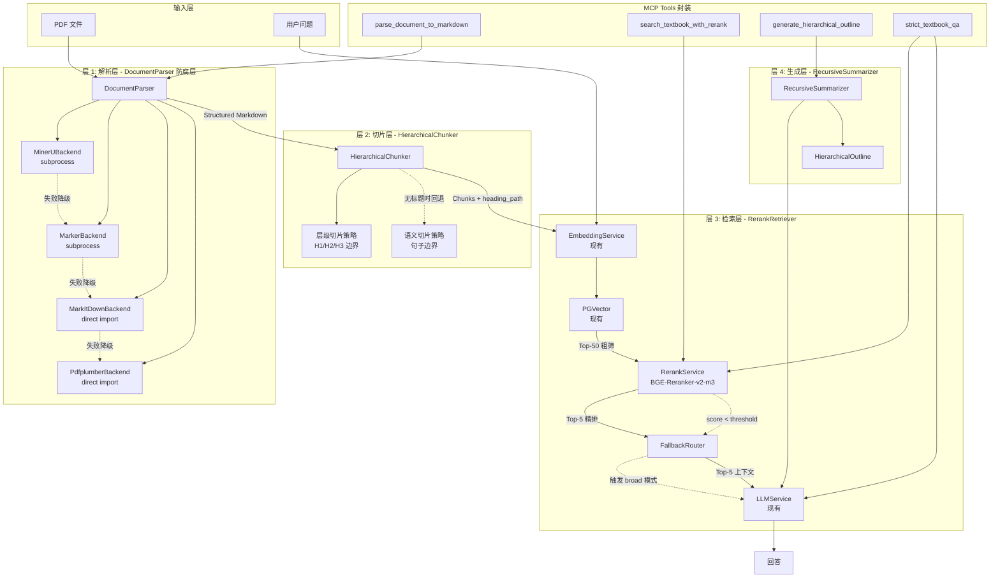
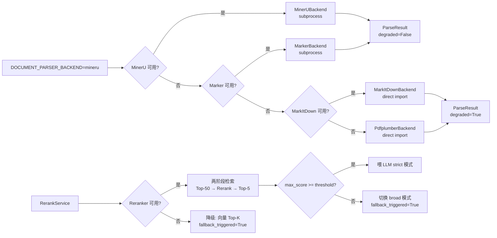
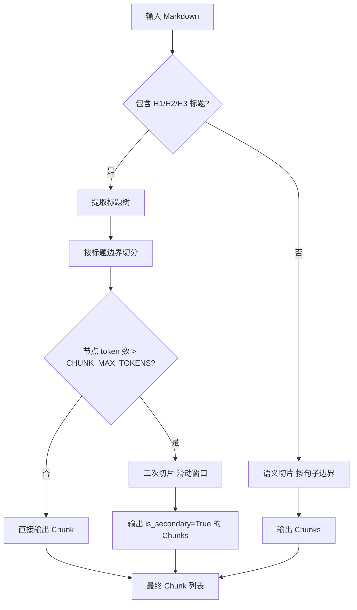
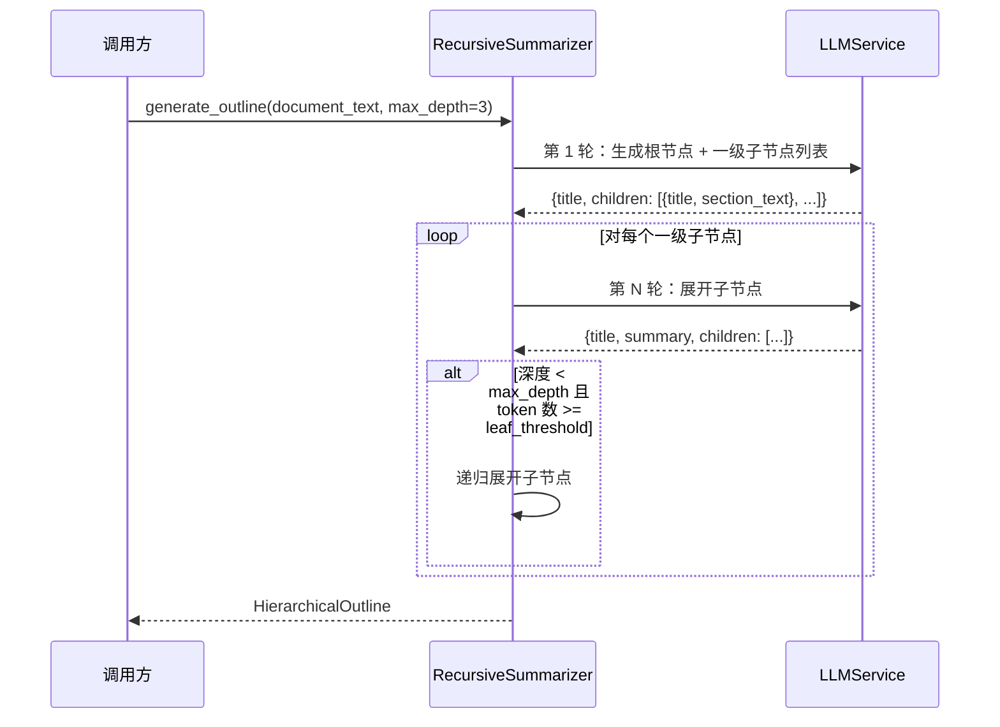
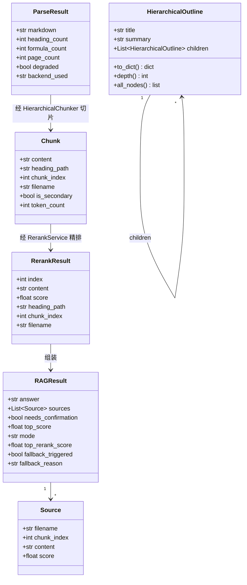
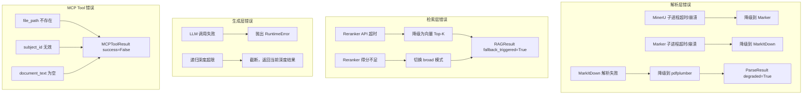

# 技术设计文档：RAG 流水线架构升级

## 概述

本文档描述「伴学」项目 RAG 流水线的四层架构升级方案。当前流水线将课本 PDF 作为扁平纯文本处理，导致检索精度低、思维导图层次混乱。本次升级重构解析层、切片层、检索层和生成层，并将新能力封装为 MCP Tools 供大模型自主调用。

### 核心设计原则

1. **防腐层（Anti-Corruption Layer）**：所有第三方解析库通过抽象接口隔离，主进程不直接 import AGPL/GPL 库
2. **License 安全**：MinerU（AGPL-3.0）和 Marker（GPL-3.0）通过独立子进程调用，规避传染性；BGE-Reranker（MIT）可直接集成
3. **渐进增强**：每层改造都有降级路径，不影响现有功能
4. **向后兼容**：query 和 query_stream 接口签名不变，调用方无需修改

### License 决策

| 工具 | License | 集成方式 |
|------|---------|---------|
| MinerU | AGPL-3.0 | 独立子进程调用（防腐层隔离） |
| Marker | GPL-3.0 + Rail-M | 独立子进程调用（防腐层隔离） |
| MarkItDown (Microsoft) | MIT | 可直接 import，作为轻量降级后端 |
| BGE-Reranker-v2-m3 (FlagEmbedding) | MIT | 直接集成，本地推理或 API 调用 |

### 执行优先级

优先改造**检索层**（Rerank 重排机制），再逐步改造解析层、切片层和生成层。

## 架构

### 整体架构图



### 数据流对比

**改造前**
```
PDF → pdfplumber 纯文本 → 固定字符切片 → Embedding → PGVector Top-8 → LLM
```

**改造后**
```
PDF → DocumentParser（MinerU/Marker/MarkItDown/pdfplumber 防腐层）
    → Structured Markdown（带 H1/H2/H3）
    → HierarchicalChunker（按标题树切片，携带 heading_path 元数据）
    → Embedding → PGVector Top-50（粗筛）
    → RerankService（BGE-Reranker-v2-m3）→ Top-5（精排）
    → LLM（高精度上下文）
```

### 降级链路图



## 组件与接口

### 层 1：DocumentParser 防腐层

**文件**：`backend/services/document_parser.py`

#### 数据模型

```python
from dataclasses import dataclass
from typing import Protocol

@dataclass
class ParseResult:
    markdown: str           # 带层级的 Structured Markdown
    heading_count: int      # 检测到的标题数量
    formula_count: int      # 检测到的公式数量
    page_count: int = 0     # 文档页数
    degraded: bool = False  # 是否降级到 pdfplumber
    backend_used: str = ""  # 实际使用的后端名称


class DocumentParserBackend(Protocol):
    def parse(self, file_path: str) -> ParseResult: ...
    def is_available(self) -> bool: ...
```

#### 后端实现

| 后端 | 调用方式 | License | 能力 |
|------|---------|---------|------|
| `MinerUBackend` | subprocess CLI | AGPL-3.0（隔离） | 最强：公式+表格+层级 |
| `MarkerBackend` | subprocess CLI | GPL-3.0（隔离） | 强：公式+表格+层级 |
| `MarkItDownBackend` | direct import | MIT | 中：表格，无 LaTeX |
| `PdfplumberBackend` | direct import | MIT | 基础：纯文本 |

#### DocumentParser 主类接口

```python
class DocumentParser:
    # 防腐层主类，根据配置选择后端，失败时自动降级
    # 降级链：mineru -> marker -> markitdown -> pdfplumber

    def __init__(self, backend: str | None = None) -> None:
        # backend: 后端名称，None 时从 DOCUMENT_PARSER_BACKEND 配置读取
        ...

    def parse(self, file_path: str) -> ParseResult:
        # 解析文件，返回 ParseResult
        # 失败时自动降级，最终降级到 pdfplumber
        # 降级时 ParseResult.degraded = True
        ...

    def _try_backend(
        self,
        backend: DocumentParserBackend,
        file_path: str,
    ) -> ParseResult | None:
        # 尝试单个后端，失败返回 None
        ...
```

#### MinerUBackend 子进程调用协议

```python
class MinerUBackend:
    # 通过 subprocess 调用 MinerU CLI
    # 主进程不 import mineru，规避 AGPL-3.0 传染性
    #
    # 调用命令：mineru parse --input <file_path> --output-format json
    # 超时：DOCUMENT_PARSER_TIMEOUT_SECONDS（默认 120s）
    # stdout JSON 格式：
    # {"markdown": "...", "heading_count": 42, "formula_count": 15, "page_count": 100}

    def parse(self, file_path: str) -> ParseResult: ...
    def is_available(self) -> bool: ...
        # 检查 mineru CLI 是否在 PATH 中
```

### 层 2：HierarchicalChunker

**文件**：`backend/services/chunker.py`

#### 数据模型

```python
@dataclass
class Chunk:
    content: str
    heading_path: str       # 标题路径，如 "第三章 > 3.2 牛顿第二定律"
    chunk_index: int        # 全局切片序号
    filename: str           # 来源文件名
    is_secondary: bool = False  # 是否为二次切片（超长节点拆分）
    token_count: int = 0    # 估算 token 数


@dataclass
class HeadingNode:
    level: int          # 1=H1, 2=H2, 3=H3
    title: str          # 标题文本
    content: str        # 该标题下的正文内容
    heading_path: str   # 完整路径，如 "第三章 > 3.2 牛顿第二定律"
```

#### HierarchicalChunker 接口

```python
class HierarchicalChunker:

    def chunk(self, markdown: str, metadata: dict) -> list[Chunk]:
        # 主入口
        # - 有标题：层级切片（按 H1/H2/H3 边界）
        # - 无标题：语义切片（按句子边界，使用 CHUNK_SIZE/CHUNK_OVERLAP）
        # - 超长节点：二次切片（滑动窗口，CHUNK_MAX_TOKENS/CHUNK_OVERLAP_TOKENS）
        ...

    def _extract_heading_tree(self, markdown: str) -> list[HeadingNode]:
        # 用正则提取所有 # ## ### 标题，构建标题树
        ...

    def _hierarchical_chunk(
        self, nodes: list[HeadingNode], filename: str,
    ) -> list[Chunk]:
        # 按标题边界切分，每个节点为一个 Chunk
        ...

    def _secondary_chunk(
        self, content: str, heading_path: str, filename: str, start_index: int,
    ) -> list[Chunk]:
        # 对超长节点进行滑动窗口二次切片
        ...

    def _semantic_chunk(self, text: str, filename: str) -> list[Chunk]:
        # 无标题时的语义切片（按句子边界）
        ...
```

#### 切片策略决策流程



### 层 3：RerankService

**文件**：`backend/services/rerank_service.py`

#### 数据模型

```python
@dataclass
class RerankResult:
    index: int        # 原始文档索引
    content: str      # 文档内容
    score: float      # 相关度得分 0~1
    heading_path: str = ""  # 来自 Chunk 元数据
    chunk_index: int = 0
    filename: str = ""
```

#### RerankService 接口

```python
class RerankService:
    # BGE-Reranker-v2-m3 重排序服务
    # 支持两种调用模式：
    # 1. 本地推理（FlagEmbedding，MIT 许可，直接 import）
    # 2. HTTP API（兼容 SiliconFlow / Jina Reranker API）

    def __init__(self) -> None:
        # 从配置读取 RERANKER_MODE（api | local）
        ...

    def rerank(
        self,
        query: str,
        documents: list[str],
        top_n: int | None = None,
    ) -> list[RerankResult]:
        # 对 documents 按 query 相关度重排序
        # 返回按 score 降序排列的结果列表
        # top_n=None 时返回全部，否则返回前 top_n 个
        ...

    def is_available(self) -> bool:
        # 检查 Reranker 服务是否可用
        ...

    def _rerank_via_api(self, query: str, documents: list[str]) -> list[RerankResult]:
        # 通过 HTTP API 调用 Reranker（SiliconFlow/Jina 兼容格式）
        ...

    def _rerank_local(self, query: str, documents: list[str]) -> list[RerankResult]:
        # 通过 FlagEmbedding 本地推理（MIT 许可，直接 import）
        ...
```

#### RAGPipeline 改造：两阶段检索

在 `rag_pipeline.py` 的 `query` 和 `query_stream` 方法中，检索逻辑改为：

```python
# 改造前
docs_with_scores = vector_store.similarity_search_with_score(question, k=cfg.TOP_K)

# 改造后
# 阶段 1：粗筛（向量检索 Top-50）
recall_docs = vector_store.similarity_search_with_score(question, k=cfg.RECALL_TOP_K)

# 阶段 2：精排（BGE-Reranker）
rerank_svc = RerankService()
if rerank_svc.is_available():
    doc_texts = [doc.page_content for doc, _ in recall_docs]
    rerank_results = rerank_svc.rerank(question, doc_texts, top_n=cfg.RERANK_TOP_N)
    top_rerank_score = rerank_results[0].score if rerank_results else 0.0
    if top_rerank_score < cfg.RERANK_THRESHOLD:
        fallback_triggered = True
        fallback_reason = f"最高 Rerank 得分 {top_rerank_score:.3f} < 阈值 {cfg.RERANK_THRESHOLD}"
    sources = build_source_from_rerank(rerank_results, recall_docs)
else:
    logger.warning("Reranker 不可用，降级为向量检索 Top-K")
    sources = build_source_from_vector(recall_docs[:cfg.TOP_K])
    fallback_triggered = True
```

#### RAGResult 新增字段

```python
@dataclass
class RAGResult:
    # 现有字段（不变）
    answer: str = ""
    sources: List[Source] = field(default_factory=list)
    needs_confirmation: bool = False
    top_score: float = 0.0
    mode: str = "strict"
    # 新增字段
    top_rerank_score: float = 0.0    # Reranker 最高得分
    fallback_triggered: bool = False  # 是否触发 Fallback
    fallback_reason: str = ""         # Fallback 原因说明
```

### 层 4：RecursiveSummarizer

**文件**：`backend/services/recursive_summarizer.py`

#### 数据模型

```python
@dataclass
class HierarchicalOutline:
    title: str                    # 节点标题（非空，<=50 字符）
    summary: str = ""             # 节点摘要
    children: list["HierarchicalOutline"] = field(default_factory=list)

    def to_dict(self) -> dict:
        return {
            "title": self.title,
            "summary": self.summary,
            "children": [c.to_dict() for c in self.children],
        }

    def depth(self) -> int:
        if not self.children:
            return 1
        return 1 + max(c.depth() for c in self.children)

    def all_nodes(self) -> list["HierarchicalOutline"]:
        result = [self]
        for child in self.children:
            result.extend(child.all_nodes())
        return result
```

#### RecursiveSummarizer 接口

```python
class RecursiveSummarizer:

    async def generate_outline(
        self,
        document_text: str,
        max_depth: int = 3,
    ) -> HierarchicalOutline:
        # 第一轮：生成根节点 + 一级子节点列表
        # 后续轮：对每个一级节点递归生成二级子节点
        # 深度限制：max_depth（默认 MINDMAP_MAX_DEPTH=3）
        # 叶节点判断：节点文本 token 数 < MINDMAP_LEAF_THRESHOLD 时停止递归
        ...

    async def _generate_root(self, document_text: str) -> HierarchicalOutline:
        # 第一轮 LLM 调用：生成根节点和一级子节点列表
        ...

    async def _expand_node(
        self,
        node: HierarchicalOutline,
        section_text: str,
        current_depth: int,
        max_depth: int,
    ) -> None:
        # 递归展开单个节点，原地修改 node.children
        ...
```

#### 递归摘要流程图



### MCP Tools 封装

**文件**: backend/mcp_layer/server_configs/rag_tools_server.py

四个 MCP Tool 通过 MCPToolDef.create() 工厂方法注册，复用现有 MCPRegistry 机制。

#### MCP Tool 返回格式

| Tool | 成功返回字段 | 失败返回 |
|------|------------|---------|
| parse_document_to_markdown | markdown_content, heading_count, formula_count, degraded | success=False + 错误信息 |
| search_textbook_with_rerank | results[{content, rerank_score, heading_path, chunk_index}] | success=False + 错误信息 |
| generate_hierarchical_outline | outline（Hierarchical_Outline JSON） | success=False + 错误信息 |
| strict_textbook_qa | answer, sources, rerank_top_score | success=False + 错误信息 |


## 数据模型

### 完整数据模型关系图



### 新增配置项（追加到 backend_config.py）

```python
# ── RAG 升级配置 ──────────────────────────────────────────────────────────────
# 解析层
DOCUMENT_PARSER_BACKEND: str = "mineru"       # mineru | marker | markitdown | pdfplumber
DOCUMENT_PARSER_TIMEOUT_SECONDS: int = 120    # 子进程调用超时

# 检索层（Rerank）
RECALL_TOP_K: int = 50                        # 粗筛召回数
RERANK_TOP_N: int = 5                         # 精排保留数
RERANK_THRESHOLD: float = 0.4                 # 低于此分触发 Fallback
RERANK_MODEL: str = "BAAI/bge-reranker-v2-m3"
RERANKER_MODE: str = "api"                    # api | local
RERANKER_API_URL: str = ""                    # HTTP Reranker API 地址
RERANKER_API_KEY: str = ""                    # Reranker API 密钥（可为空）

# 切片层
CHUNK_MAX_TOKENS: int = 512                   # 单 Chunk 最大 token 数
CHUNK_OVERLAP_TOKENS: int = 64                # 相邻 Chunk 重叠 token 数

# 生成层（思维导图）
MINDMAP_MAX_DEPTH: int = 3                    # 递归最大深度
MINDMAP_LEAF_THRESHOLD: int = 200             # 叶节点 token 阈值
```

### 文件变更清单

#### 新建文件

| 文件 | 说明 |
|------|------|
| `backend/services/document_parser.py` | DocumentParser 防腐层 + 四个后端实现 |
| `backend/services/chunker.py` | HierarchicalChunker 层级切片器 |
| `backend/services/rerank_service.py` | RerankService（BGE-Reranker 封装） |
| `backend/services/recursive_summarizer.py` | RecursiveSummarizer（思维导图递归摘要） |
| `backend/mcp_layer/server_configs/rag_tools_server.py` | 四个 RAG MCP Tools 注册 |

#### 修改文件

| 文件 | 变更内容 |
|------|---------|
| `backend/services/rag_pipeline.py` | 检索层改为两阶段（粗筛+Rerank），RAGResult 新增字段 |
| `backend/services/file_parser.py` | 调用 DocumentParser 防腐层，保持向后兼容 |
| `backend/backend_config.py` | 新增 RAG 升级相关配置项 |

#### 不需要修改

- `backend/services/embedding_service.py` — 复用现有 Embedding
- `backend/mcp_layer/mcp_registry.py` — 复用现有注册机制
- 所有路由文件 — 接口签名不变

---

## 正确性属性

*属性（Property）是在系统所有有效执行中都应成立的特征或行为——本质上是对系统应该做什么的形式化陈述。属性是人类可读规范与机器可验证正确性保证之间的桥梁。*

### 属性 1：解析降级保证

*对于任意* 解析后端调用失败的情况，`DocumentParser.parse()` 应始终返回一个 `ParseResult`，其中 `degraded=True` 且 `markdown` 字段为非空字符串（来自 pdfplumber 降级）。

**验证需求：需求 1.5**

### 属性 2：ParseResult 类型不变量

*对于任意* 输入文件路径，`DocumentParser.parse()` 的返回值始终是一个 `ParseResult` 实例，其 `markdown` 字段为字符串类型，`heading_count` 和 `formula_count` 为非负整数。

**验证需求：需求 1.6**

### 属性 3：Chunk 大小上限不变量

*对于任意* 输入文本和任意 `CHUNK_MAX_TOKENS` 配置值，`HierarchicalChunker.chunk()` 返回的所有 Chunk 的 `token_count` 均不超过 `CHUNK_MAX_TOKENS`。

**验证需求：需求 2.4、2.7**

### 属性 4：层级切片携带标题路径

*对于任意* 包含 H1/H2/H3 标题的 Markdown 文本，`HierarchicalChunker.chunk()` 返回的所有 Chunk 的 `heading_path` 字段均为非空字符串。

**验证需求：需求 2.2、2.6**

### 属性 5：Rerank 输出降序排列

*对于任意* 查询文本和文档列表，`RerankService.rerank()` 返回的结果列表按 `score` 字段严格降序排列（即 `results[i].score >= results[i+1].score` 对所有相邻元素成立）。

**验证需求：需求 3.4**

### 属性 6：Rerank 结果数量上限

*对于任意* 粗筛召回结果，经 `RerankService.rerank(top_n=RERANK_TOP_N)` 后，最终传入 LLM 的片段数量不超过 `RERANK_TOP_N`。

**验证需求：需求 3.5**

### 属性 7：低分触发 Fallback

*对于任意* Rerank 结果，若最高得分 `max_score < RERANK_THRESHOLD`，则 `RAGResult.fallback_triggered` 必须为 `True`，且 `fallback_reason` 为非空字符串。

**验证需求：需求 3.6、3.9**

### 属性 8：top_rerank_score 等于最高得分

*对于任意* 成功的 Rerank 调用，`RAGResult.top_rerank_score` 必须等于 `rerank_results` 中所有 `score` 的最大值。

**验证需求：需求 3.8**

### 属性 9：大纲深度不超过上限

*对于任意* 文档文本和任意 `max_depth` 配置值，`RecursiveSummarizer.generate_outline()` 返回的 `HierarchicalOutline` 的最大嵌套深度不超过 `max_depth`。

**验证需求：需求 4.5**

### 属性 10：大纲节点标题合法性

*对于任意* 生成的 `HierarchicalOutline`，其所有节点（递归遍历）的 `title` 字段均为非空字符串且长度不超过 50 个字符。

**验证需求：需求 4.7**

### 属性 11：HierarchicalOutline 序列化往返

*对于任意* `HierarchicalOutline` 实例，`to_dict()` 返回的字典必须可被 `json.dumps()` 序列化，且包含 `title` 和 `children` 字段。

**验证需求：需求 4.4、7.4**

---

## 错误处理

### 错误处理策略总览



### 各层错误处理细节

#### 解析层（DocumentParser）

| 错误场景 | 处理方式 | 日志级别 |
|---------|---------|---------|
| 子进程超时（>DOCUMENT_PARSER_TIMEOUT_SECONDS） | 终止子进程，降级到下一后端 | WARNING |
| 子进程返回非零退出码 | 降级到下一后端 | WARNING |
| stdout JSON 解析失败 | 降级到下一后端 | WARNING |
| 所有后端均失败 | 使用 pdfplumber，`degraded=True` | ERROR |
| 文件不存在 | 抛出 `FileNotFoundError` | ERROR |

#### 检索层（RerankService）

| 错误场景 | 处理方式 | 日志级别 |
|---------|---------|---------|
| Reranker API 连接超时 | 降级为向量 Top-K，`fallback_triggered=True` | WARNING |
| Reranker API 返回 4xx/5xx | 降级为向量 Top-K，`fallback_triggered=True` | WARNING |
| 本地模型加载失败 | 降级为 API 模式，若 API 也不可用则降级为向量 Top-K | ERROR |
| 最高得分 < RERANK_THRESHOLD | 切换 broad 模式，`fallback_triggered=True` | INFO |

#### 生成层（RecursiveSummarizer）

| 错误场景 | 处理方式 | 日志级别 |
|---------|---------|---------|
| LLM 返回非法 JSON | 重试一次，失败则返回空 children | WARNING |
| 递归深度超过 max_depth | 停止递归，返回当前节点作为叶节点 | DEBUG |
| 节点 token 数 < MINDMAP_LEAF_THRESHOLD | 标记为叶节点，停止递归 | DEBUG |
| LLM 生成的 title 超过 50 字符 | 截断到 50 字符 | WARNING |

#### MCP Tools

所有 MCP Tool 遵循统一错误返回格式：

```python
# 成功
MCPToolResult(success=True, data={"key": "value"})

# 失败
MCPToolResult(
    success=False,
    error_message="描述性错误信息",
    degraded=True,  # 若发生降级
)
```

---

## 测试策略

### 测试分层

```
单元测试（Unit Tests）
├── DocumentParser 防腐层
│   ├── 各后端 parse() 返回 ParseResult 类型验证
│   ├── 降级链路测试（mock subprocess 失败）
│   └── ParseResult 字段完整性验证
├── HierarchicalChunker
│   ├── 层级切片：有标题 Markdown 的 heading_path 验证
│   ├── 语义切片：无标题文本的回退验证
│   ├── Chunk 大小上限验证
│   └── 二次切片触发验证
├── RerankService
│   ├── 输出降序排列验证
│   ├── top_n 截断验证
│   ├── API 模式 mock 测试
│   └── 降级路径测试
└── RecursiveSummarizer
    ├── 深度限制验证
    ├── 叶节点判断验证
    ├── title 长度截断验证
    └── to_dict() 序列化验证

集成测试（Integration Tests）
├── DocumentParser + 真实 PDF（含标题/表格/公式）
├── RAGPipeline 两阶段检索端到端
└── MCP Tool 调用链路

冒烟测试（Smoke Tests）
├── MCP Tool 注册验证（4 个 Tool 均已注册）
├── 配置项默认值验证
└── 子进程 CLI 可用性检查
```

### 属性测试配置

使用 **Hypothesis**（Python 属性测试库，MIT 许可）实现属性测试。

```python
# 示例：属性 3 - Chunk 大小上限不变量
from hypothesis import given, settings
import hypothesis.strategies as st

@given(
    markdown=st.text(min_size=1, max_size=10000),
    max_tokens=st.integers(min_value=64, max_value=2048),
)
@settings(max_examples=100)
def test_chunk_size_invariant(markdown, max_tokens):
    # Feature: rag-pipeline-upgrade, Property 3: Chunk 大小上限不变量
    # For any input text and CHUNK_MAX_TOKENS, all chunks should have
    # token_count <= CHUNK_MAX_TOKENS.
    chunker = HierarchicalChunker(max_tokens=max_tokens)
    chunks = chunker.chunk(markdown, metadata={"filename": "test.pdf"})
    for chunk in chunks:
        assert chunk.token_count <= max_tokens
```

```python
# 示例：属性 5 - Rerank 输出降序排列
@given(
    query=st.text(min_size=1, max_size=200),
    documents=st.lists(st.text(min_size=1, max_size=500), min_size=1, max_size=50),
)
@settings(max_examples=100)
def test_rerank_descending_order(query, documents):
    # Feature: rag-pipeline-upgrade, Property 5: Rerank 输出降序排列
    # For any query and documents, rerank results should be sorted by score descending.
    svc = RerankService()  # 使用 mock 后端
    results = svc.rerank(query, documents)
    scores = [r.score for r in results]
    assert scores == sorted(scores, reverse=True)
```

```python
# 示例：属性 9 - 大纲深度不超过上限
@given(
    document_text=st.text(min_size=100, max_size=5000),
    max_depth=st.integers(min_value=1, max_value=5),
)
@settings(max_examples=100)
def test_outline_depth_limit(document_text, max_depth):
    # Feature: rag-pipeline-upgrade, Property 9: 大纲深度不超过上限
    # For any document text and max_depth, the generated outline depth
    # should never exceed max_depth.
    summarizer = RecursiveSummarizer()
    outline = asyncio.run(summarizer.generate_outline(document_text, max_depth=max_depth))
    assert outline.depth() <= max_depth
```

### 每个属性测试的最低迭代次数

所有属性测试配置 `@settings(max_examples=100)`，确保至少 100 次随机输入覆盖。

### 测试标签格式

每个属性测试必须包含注释：

```
Feature: rag-pipeline-upgrade, Property {N}: {property_text}
```
