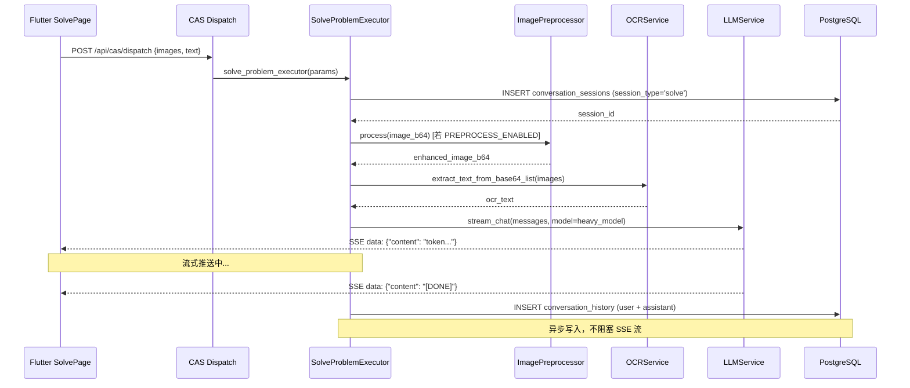
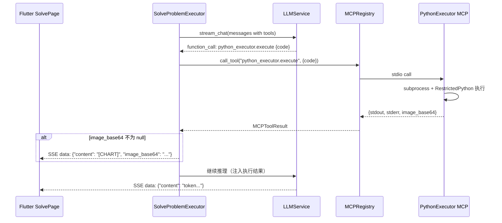
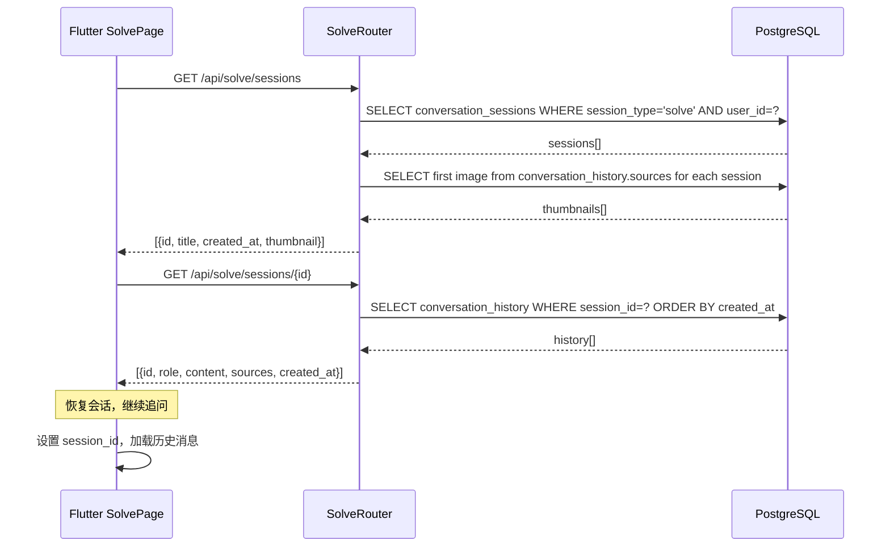

# 设计文档：solve-enhancement

## 概述

本设计文档描述"伴学"项目解题模块（SolvePage）的三项增强功能的技术实现方案。

### 功能概览

1. **解题历史记录**：将纯内存的解题会话持久化到现有数据库表（conversation_sessions / conversation_history），支持历史查看、恢复与删除。
2. **Python 计算引擎（MCP 工具）**：通过 MCP function calling 将精确数值计算卸载到后端 Python 沙箱，提升解题准确性。
3. **图像预处理优化（OpenCV 五步流水线）**：在 OCR 之前对题目图片进行语义无损的五步预处理，将手机拍摄的模糊、倾斜、光照不均的题目照片转化为 AI 可精准理解的标准文档图像。

### 设计原则

- **向后兼容**：所有增强功能通过配置开关控制，默认禁用时行为与现有版本完全一致。
- **渐进增强**：三项功能独立可测，互不依赖，可分阶段上线。
- **语义保真**：图像预处理只增强可读性，绝不修改公式结构、文字内容、几何图形的语义信息。
- **容错降级**：任何子功能失败时自动降级到现有流程，不中断用户体验。

---

## 系统架构

### 整体架构图

\\\mermaid
graph TB
    subgraph "前端 Flutter"
        A[SolvePage] --> B[历史记录 Sheet]
        A --> C[解题对话区]
        C --> D[图表渲染组件]
    end

    subgraph "后端 FastAPI"
        E[/api/cas/dispatch] --> F[SolveProblemExecutor]
        G[/api/solve/sessions] --> H[SolveRouter]
        H --> I[ConversationSession 查询]
        
        F --> J[ImagePreprocessor]
        J --> K[OCRService]
        K --> L[LLMService]
        
        F --> M[MCPRegistry]
        M --> N[PythonExecutor MCP]
        
        L --> O[SSE 流式推送]
        O --> P[异步持久化]
        P --> Q[(PostgreSQL)]
    end

    subgraph "MCP 层"
        N --> R[subprocess 沙箱]
        R --> S[RestrictedPython]
        R --> T[matplotlib]
    end

    A -->|1. 拍照上传| E
    E -->|2. 预处理| J
    J -->|3. OCR| K
    K -->|4. 推理| L
    L -->|5. function call| M
    M -->|6. 执行计算| N
    N -->|7. 返回结果| L
    L -->|8. SSE 流| O
    O -->|9. 前端渲染| C
    P -->|10. 写入数据库| Q
    A -->|11. 查询历史| G
    G -->|12. 返回列表| A

### 数据流序列图

#### 子功能 1：首次解题 + 持久化



#### 子功能 2：Python 计算引擎调用



#### 子功能 3：历史记录查询与恢复



---

## 组件与接口详细设计

### 子功能 1：解题历史记录

#### 1.1 数据库设计

复用现有表，无需新建表。

**`conversation_sessions` 表**（现有，新增 `session_type='solve'` 用法）：

| 字段 | 类型 | 说明 |
|------|------|------|
| id | Integer PK | 会话 ID |
| user_id | Integer FK | 用户 ID |
| title | String(256) | 会话标题（OCR 文本前 15 字符） |
| session_type | String(32) | 固定为 `'solve'` |
| created_at | DateTime | 创建时间 |

**`conversation_history` 表**（现有，新增 `sources` 字段用法）：

| 字段 | 类型 | 说明 |
|------|------|------|
| id | Integer PK | 消息 ID |
| session_id | Integer FK | 关联会话 ID |
| role | String(16) | `'user'` 或 `'assistant'` |
| content | Text | 消息文本内容 |
| sources | JSONB | 图片存储：`{"images": ["b64_1", ...]}` |
| created_at | DateTime | 创建时间 |

#### 1.2 SolveProblemExecutor 改造

**关键代码结构**：

```python
# backend/cas/executors/solve_problem.py

async def solve_problem_executor(params: dict, user_id: int) -> StreamingResponse:
    # 新增：会话管理
    session_id = params.get("session_id")
    
    # 首次解题：创建 session
    if not session_id:
        session_id = await _create_solve_session(user_id, ocr_text)
    
    # ... 现有 OCR + 推理逻辑 ...
    
    # 新增：流式完成后异步持久化
    async def generate_sse():
        full_response = []
        async for token in LLMService().stream_chat(...):
            full_response.append(token)
            yield f"data: {json.dumps({'content': token, 'session_id': session_id})}\n\n"
        
        yield f"data: {json.dumps({'content': '[DONE]', 'session_id': session_id})}\n\n"
        
        # 异步写入，不阻塞 SSE 流
        asyncio.create_task(
            _persist_conversation(
                session_id=session_id,
                user_content=user_content,
                assistant_content="".join(full_response),
                images=images,
            )
        )
    
    return StreamingResponse(generate_sse(), media_type="text/event-stream")


async def _create_solve_session(user_id: int, ocr_text: str) -> int:
    """创建解题会话，返回 session_id。"""
    title = _generate_title(ocr_text)
    with get_session() as db:
        session = ConversationSession(
            user_id=user_id,
            session_type="solve",
            title=title,
        )
        db.add(session)
        db.flush()
        return session.id


def _generate_title(ocr_text: str) -> str:
    """根据 OCR 文本生成会话标题（纯函数，便于属性测试）。"""
    from datetime import datetime
    if not ocr_text or not ocr_text.strip():
        return f"解题记录 {datetime.now().strftime('%m-%d %H:%M')}"
    title = ocr_text.strip()[:15]
    if len(ocr_text.strip()) > 15:
        title += "…"
    return title


async def _persist_conversation(
    session_id: int,
    user_content: str,
    assistant_content: str,
    images: list[str],
) -> None:
    """异步持久化对话记录（不阻塞 SSE 流）。"""
    try:
        sources = {"images": images} if images else None
        with get_session() as db:
            db.add(ConversationHistory(
                session_id=session_id,
                role="user",
                content=user_content,
                sources=sources,
            ))
            db.add(ConversationHistory(
                session_id=session_id,
                role="assistant",
                content=assistant_content,
            ))
    except Exception as e:
        logger.error("持久化对话记录失败 session_id=%s: %s", session_id, e)
```

#### 1.3 后端 API 路由

**新建文件**：`backend/routers/solve.py`

```python
# backend/routers/solve.py

router = APIRouter()

@router.get("/sessions")
async def list_solve_sessions(user=Depends(get_current_user)):
    """GET /api/solve/sessions — 历史列表（含缩略图）"""
    user_id = int(user["id"])
    with get_session() as db:
        sessions = (
            db.query(ConversationSession)
            .filter_by(user_id=user_id, session_type="solve")
            .order_by(ConversationSession.created_at.desc())
            .all()
        )
        result = []
        for s in sessions:
            # 取首条用户消息的第一张图片作为缩略图
            first_msg = (
                db.query(ConversationHistory)
                .filter_by(session_id=s.id, role="user")
                .order_by(ConversationHistory.created_at)
                .first()
            )
            thumbnail = None
            if first_msg and first_msg.sources:
                images = first_msg.sources.get("images", [])
                if images:
                    thumbnail = images[0][:200]  # 截取前 200 字符作为缩略图预览
            result.append({
                "id": s.id,
                "title": s.title,
                "created_at": s.created_at.isoformat(),
                "thumbnail": thumbnail,
            })
    return result


@router.get("/sessions/{session_id}")
async def get_solve_session(session_id: int, user=Depends(get_current_user)):
    """GET /api/solve/sessions/{id} — 会话详情"""
    user_id = int(user["id"])
    with get_session() as db:
        session = db.query(ConversationSession).filter_by(
            id=session_id, user_id=user_id, session_type="solve"
        ).first()
        if not session:
            raise HTTPException(status_code=403, detail="无权访问该会话")
        history = (
            db.query(ConversationHistory)
            .filter_by(session_id=session_id)
            .order_by(ConversationHistory.created_at)
            .all()
        )
        return [
            {
                "id": h.id,
                "role": h.role,
                "content": h.content,
                "sources": h.sources,
                "created_at": h.created_at.isoformat(),
            }
            for h in history
        ]


@router.delete("/sessions/{session_id}")
async def delete_solve_session(session_id: int, user=Depends(get_current_user)):
    """DELETE /api/solve/sessions/{id} — 删除会话（级联删除历史消息）"""
    user_id = int(user["id"])
    with get_session() as db:
        session = db.query(ConversationSession).filter_by(
            id=session_id, user_id=user_id, session_type="solve"
        ).first()
        if not session:
            raise HTTPException(status_code=403, detail="无权删除该会话")
        db.delete(session)  # 级联删除 conversation_history
    return {"success": True}
```


### 子功能 2：Python 计算引擎

#### 2.1 MCP 服务器实现

**新建文件**：`backend/mcp_servers/python_executor_server.py`

```python
# backend/mcp_servers/python_executor_server.py
"""
Python 计算引擎 MCP 服务器。
使用 subprocess + RestrictedPython 双重隔离，提供安全的 Python 代码执行环境。
"""
import base64
import io
import json
import resource
import signal
import subprocess
import sys
import textwrap
from mcp.server import Server
from mcp.server.stdio import stdio_server
from mcp.types import Tool, TextContent

app = Server("python_executor")

# 黑名单模块
_BLOCKED_MODULES = {"os", "sys", "subprocess", "socket", "requests", "urllib"}

_SANDBOX_WRAPPER = '''
import sys
import io
import base64

# 黑名单检查
_BLOCKED = {blocked_modules}
_original_import = __builtins__.__import__ if hasattr(__builtins__, '__import__') else __import__

def _safe_import(name, *args, **kwargs):
    if name.split('.')[0] in _BLOCKED:
        raise ImportError(f"禁止导入模块: {{name}}")
    return _original_import(name, *args, **kwargs)

__builtins__.__import__ = _safe_import

# 重定向 stdout/stderr
_stdout_buf = io.StringIO()
_stderr_buf = io.StringIO()
sys.stdout = _stdout_buf
sys.stderr = _stderr_buf

# 图表捕获
_chart_b64 = None
try:
    import matplotlib
    matplotlib.use('Agg')
    import matplotlib.pyplot as plt
    _orig_show = plt.show
    def _capture_show(*args, **kwargs):
        global _chart_b64
        buf = io.BytesIO()
        plt.savefig(buf, format='png', bbox_inches='tight', dpi=150)
        buf.seek(0)
        _chart_b64 = base64.b64encode(buf.read()).decode('utf-8')
        plt.close('all')
    plt.show = _capture_show
except ImportError:
    pass

# 执行用户代码
try:
{user_code}
except Exception as e:
    print(f"执行错误: {{e}}", file=sys.stderr)

# 输出结果
import json
result = {{
    "stdout": _stdout_buf.getvalue(),
    "stderr": _stderr_buf.getvalue(),
    "image_base64": _chart_b64,
}}
print("__RESULT__:" + json.dumps(result, ensure_ascii=False))
'''


@app.list_tools()
async def list_tools() -> list[Tool]:
    return [
        Tool(
            name="execute",
            description=(
                "在受限 Python 沙箱中执行代码，支持 sympy/numpy/scipy/matplotlib。"
                "适用于积分、方程求解、矩阵运算、数值计算等精确计算场景。"
                "禁止访问文件系统、网络和系统模块。"
            ),
            inputSchema={
                "type": "object",
                "properties": {
                    "code": {
                        "type": "string",
                        "description": "待执行的 Python 代码",
                    }
                },
                "required": ["code"],
            },
        )
    ]


@app.call_tool()
async def call_tool(name: str, arguments: dict) -> list[TextContent]:
    if name != "execute":
        raise ValueError(f"未知工具: {name}")
    
    code = arguments.get("code", "")
    result = _execute_sandboxed(code)
    return [TextContent(type="text", text=json.dumps(result, ensure_ascii=False))]


def _execute_sandboxed(code: str) -> dict:
    """在子进程中执行代码，10 秒超时，256MB 内存限制。"""
    indented_code = textwrap.indent(code, "    ")
    wrapper = _SANDBOX_WRAPPER.format(
        blocked_modules=str(_BLOCKED_MODULES),
        user_code=indented_code,
    )
    
    def _set_limits():
        # 内存限制 256MB
        resource.setrlimit(resource.RLIMIT_AS, (256 * 1024 * 1024, 256 * 1024 * 1024))
    
    try:
        proc = subprocess.run(
            [sys.executable, "-c", wrapper],
            capture_output=True,
            text=True,
            timeout=10,
            preexec_fn=_set_limits,
        )
        # 解析 __RESULT__ 标记
        for line in proc.stdout.splitlines():
            if line.startswith("__RESULT__:"):
                return json.loads(line[len("__RESULT__:"):])
        return {
            "stdout": proc.stdout,
            "stderr": proc.stderr or "执行完成但无结构化输出",
            "image_base64": None,
        }
    except subprocess.TimeoutExpired:
        return {
            "stdout": "",
            "stderr": "执行超时（>10s），已强制终止",
            "image_base64": None,
        }
    except MemoryError:
        return {
            "stdout": "",
            "stderr": "内存超限（>256MB），已强制终止",
            "image_base64": None,
        }


if __name__ == "__main__":
    import asyncio
    asyncio.run(stdio_server(app))
```

#### 2.2 MCP 服务器注册配置

**新建文件**：`backend/mcp_layer/server_configs/python_executor_server.py`

```python
# backend/mcp_layer/server_configs/python_executor_server.py
"""Python 计算引擎 MCP 服务器注册配置。"""
import os
import sys
from mcp_layer.models import MCPServerConfig, MCPServerType

_SERVER_SCRIPT = os.path.join(
    os.path.dirname(__file__), "..", "..", "mcp_servers", "python_executor_server.py"
)

PYTHON_EXECUTOR_SERVER_CONFIG = MCPServerConfig(
    server_id="python_executor",
    name="Python 计算引擎",
    type=MCPServerType.local,
    command=sys.executable,
    args=[_SERVER_SCRIPT],
    env={},
)
```

#### 2.3 SolveProblemExecutor 集成 Python 计算工具

**改造 `solve_problem.py`**，新增双轨触发逻辑：

```python
# 新增系统提示词（追加到现有 _SOLVE_SYSTEM_PROMPT）
_PYTHON_TOOL_PROMPT = """
你可以调用 python_executor 工具进行精确数值计算。
适用场景：积分、方程求解、矩阵运算、数值模拟、绘制函数图像。
调用格式：
  工具名：python_executor.execute
  参数：{"code": "import sympy as sp\\nx = sp.Symbol('x')\\nprint(sp.integrate(x**2, x))"}
注意：工具支持 sympy、numpy、scipy、matplotlib，禁止访问文件系统和网络。
"""

async def generate_sse():
    # ... 现有推理逻辑 ...
    
    # 处理 function calling
    async for chunk in LLMService().stream_chat_with_tools(messages, tools=_get_tools()):
        if chunk.get("type") == "function_call":
            # Function calling 路径
            tool_result = await _handle_tool_call(chunk)
            if tool_result.get("image_base64"):
                yield f"data: {json.dumps({'content': '[CHART]', 'image_base64': tool_result['image_base64']})}\n\n"
            # 注入结果到上下文继续推理
            messages.append({"role": "tool", "content": json.dumps(tool_result)})
        elif chunk.get("type") == "text":
            token = chunk["text"]
            # 代码块检测路径：检测 ```python 块
            yield f"data: {json.dumps({'content': token})}\n\n"


async def _handle_tool_call(chunk: dict) -> dict:
    """处理 function calling 工具调用。"""
    from mcp_layer.mcp_registry import get_registry
    registry = get_registry()
    result = registry.call_tool(
        "python_executor.execute",
        arguments=chunk.get("arguments", {}),
        timeout_seconds=12.0,
    )
    if result.success:
        return json.loads(result.data.get("text", "{}"))
    else:
        return {
            "stdout": "",
            "stderr": f"工具调用失败：{result.error_message}，请改用纯文字推理",
            "image_base64": None,
        }
```


### 子功能 3：图像预处理（OpenCV 五步流水线）

#### 3.1 ImagePreprocessor 服务

**新建文件**：`backend/services/image_preprocessor.py`

```python
# backend/services/image_preprocessor.py
"""
图像预处理服务：OpenCV 五步流水线。
在 OCR 之前对题目图片进行语义无损的预处理。

五步流水线（按顺序，每步独立容错）：
  1. EXIF 方向矫正（Pillow）
  2. 2D 倾斜矫正（Canny + 霍夫变换 + 仿射变换）
  3. Retinex 光照均衡 + CLAHE（LAB 色彩空间 L 通道）
  4. NLM 去噪 + Unsharp Mask 锐化
  5. 摩尔纹检测与去除（傅里叶频域滤波）
"""
from __future__ import annotations

import base64
import io
import logging
import os
import time
from dataclasses import dataclass, field
from typing import Optional

import cv2
import numpy as np
from PIL import Image, ExifTags

logger = logging.getLogger(__name__)

# 环境变量开关（默认均为 True）
_STEP_ENABLED = {
    "exif_correct": os.getenv("PREPROCESS_EXIF_CORRECT", "true").lower() == "true",
    "deskew": os.getenv("PREPROCESS_DESKEW", "true").lower() == "true",
    "retinex_clahe": os.getenv("PREPROCESS_RETINEX_CLAHE", "true").lower() == "true",
    "nlm_sharpen": os.getenv("PREPROCESS_NLM_SHARPEN", "true").lower() == "true",
    "moire_remove": os.getenv("PREPROCESS_MOIRE_REMOVE", "true").lower() == "true",
}


@dataclass
class StepLog:
    name: str
    skipped: bool = False
    elapsed_ms: float = 0.0
    reason: str = ""


@dataclass
class PreprocessResult:
    image_b64: str
    step_logs: list[StepLog] = field(default_factory=list)
    total_ms: float = 0.0
    input_size: tuple[int, int] = (0, 0)
    output_size: tuple[int, int] = (0, 0)
    degraded: bool = False  # True 表示所有步骤失败，返回原始图片


class ImagePreprocessor:
    """图像预处理服务，五步流水线，每步独立容错。"""

    def process(self, image_b64: str) -> PreprocessResult:
        """
        执行五步预处理流水线。
        任意步骤失败时记录 WARNING 日志并跳过，继续执行后续步骤。
        所有步骤均失败时返回原始图片。
        """
        start = time.monotonic()
        step_logs: list[StepLog] = []
        
        # 解码输入图片
        try:
            img_bytes = base64.b64decode(image_b64)
            pil_img = Image.open(io.BytesIO(img_bytes))
            input_size = pil_img.size  # (width, height)
        except Exception as e:
            logger.error("ImagePreprocessor: 图片解码失败: %s", e)
            return PreprocessResult(image_b64=image_b64, degraded=True)

        # 步骤 1：EXIF 方向矫正
        pil_img, log = self._step_exif_correct(pil_img)
        step_logs.append(log)

        # 转换为 OpenCV 格式
        cv_img = cv2.cvtColor(np.array(pil_img), cv2.COLOR_RGB2BGR)

        # 步骤 2：2D 倾斜矫正
        cv_img, log = self._step_deskew(cv_img)
        step_logs.append(log)

        # 步骤 3：Retinex 光照均衡 + CLAHE
        cv_img, log = self._step_retinex_clahe(cv_img)
        step_logs.append(log)

        # 步骤 4：NLM 去噪 + Unsharp Mask 锐化
        cv_img, log = self._step_nlm_sharpen(cv_img)
        step_logs.append(log)

        # 步骤 5：摩尔纹检测与去除
        cv_img, log = self._step_moire_remove(cv_img)
        step_logs.append(log)

        # 编码输出图片（JPEG 质量 90）
        try:
            output_pil = Image.fromarray(cv2.cvtColor(cv_img, cv2.COLOR_BGR2RGB))
            output_size = output_pil.size
            buf = io.BytesIO()
            output_pil.save(buf, format="JPEG", quality=90)
            result_b64 = base64.b64encode(buf.getvalue()).decode("utf-8")
        except Exception as e:
            logger.error("ImagePreprocessor: 图片编码失败: %s", e)
            result_b64 = image_b64
            output_size = input_size

        total_ms = (time.monotonic() - start) * 1000
        
        # 结构化性能日志
        logger.info(
            "ImagePreprocessor 完成 total_ms=%.1f input=%s output=%s steps=%s",
            total_ms,
            input_size,
            output_size,
            [{s.name: {"skipped": s.skipped, "ms": round(s.elapsed_ms, 1)}} for s in step_logs],
        )
        
        return PreprocessResult(
            image_b64=result_b64,
            step_logs=step_logs,
            total_ms=total_ms,
            input_size=input_size,
            output_size=output_size,
        )

    def _step_exif_correct(self, img: Image.Image) -> tuple[Image.Image, StepLog]:
        """步骤 1：EXIF 方向矫正。"""
        log = StepLog(name="exif_correct")
        t = time.monotonic()
        if not _STEP_ENABLED["exif_correct"]:
            log.skipped = True
            log.reason = "配置禁用"
            return img, log
        try:
            exif = img._getexif()
            if exif is None:
                log.skipped = True
                log.reason = "无 EXIF 信息"
                return img, log
            
            orientation_key = next(
                (k for k, v in ExifTags.TAGS.items() if v == "Orientation"), None
            )
            if orientation_key is None or orientation_key not in exif:
                log.skipped = True
                log.reason = "无方向标签"
                return img, log
            
            orientation = exif[orientation_key]
            _ORIENTATION_MAP = {
                2: Image.FLIP_LEFT_RIGHT,
                3: Image.ROTATE_180,
                4: Image.FLIP_TOP_BOTTOM,
                5: (Image.FLIP_LEFT_RIGHT, Image.ROTATE_90),
                6: Image.ROTATE_270,
                7: (Image.FLIP_LEFT_RIGHT, Image.ROTATE_270),
                8: Image.ROTATE_90,
            }
            if orientation in _ORIENTATION_MAP:
                op = _ORIENTATION_MAP[orientation]
                if isinstance(op, tuple):
                    img = img.transpose(op[0]).transpose(op[1])
                else:
                    img = img.transpose(op)
            
            # 丢弃 EXIF 方向标签
            img.info.pop("exif", None)
        except Exception as e:
            logger.warning("ImagePreprocessor: EXIF 矫正失败: %s", e)
            log.reason = str(e)
        log.elapsed_ms = (time.monotonic() - t) * 1000
        return img, log

    def _step_deskew(self, img: np.ndarray) -> tuple[np.ndarray, StepLog]:
        """步骤 2：2D 倾斜矫正（Canny + 霍夫变换）。"""
        log = StepLog(name="deskew")
        t = time.monotonic()
        if not _STEP_ENABLED["deskew"]:
            log.skipped = True
            log.reason = "配置禁用"
            return img, log
        try:
            gray = cv2.cvtColor(img, cv2.COLOR_BGR2GRAY)
            edges = cv2.Canny(gray, 50, 150, apertureSize=3)
            lines = cv2.HoughLinesP(edges, 1, np.pi / 180, 100, minLineLength=100, maxLineGap=10)
            
            if lines is None or len(lines) == 0:
                log.skipped = True
                log.reason = "未检测到直线"
                return img, log
            
            angles = []
            for line in lines:
                x1, y1, x2, y2 = line[0]
                if x2 != x1:
                    angle = np.degrees(np.arctan2(y2 - y1, x2 - x1))
                    if -45 < angle < 45:
                        angles.append(angle)
            
            if not angles:
                log.skipped = True
                log.reason = "无有效角度"
                return img, log
            
            median_angle = float(np.median(angles))
            abs_angle = abs(median_angle)
            
            if abs_angle < 0.5:
                log.skipped = True
                log.reason = f"倾斜角 {median_angle:.2f}° < 0.5°，无需矫正"
                return img, log
            if abs_angle > 15:
                log.skipped = True
                log.reason = f"倾斜角 {median_angle:.2f}° > 15°，可能是竖排文字，跳过"
                return img, log
            
            h, w = img.shape[:2]
            center = (w // 2, h // 2)
            M = cv2.getRotationMatrix2D(center, median_angle, 1.0)
            img = cv2.warpAffine(
                img, M, (w, h),
                flags=cv2.INTER_LINEAR,
                borderMode=cv2.BORDER_CONSTANT,
                borderValue=(255, 255, 255),
            )
        except Exception as e:
            logger.warning("ImagePreprocessor: 倾斜矫正失败: %s", e)
            log.reason = str(e)
        log.elapsed_ms = (time.monotonic() - t) * 1000
        return img, log

    def _step_retinex_clahe(self, img: np.ndarray) -> tuple[np.ndarray, StepLog]:
        """步骤 3：Retinex 光照均衡 + CLAHE。"""
        log = StepLog(name="retinex_clahe")
        t = time.monotonic()
        if not _STEP_ENABLED["retinex_clahe"]:
            log.skipped = True
            log.reason = "配置禁用"
            return img, log
        try:
            # 检查亮度均匀性
            gray = cv2.cvtColor(img, cv2.COLOR_BGR2GRAY)
            std_dev = float(np.std(gray))
            
            if std_dev >= 20:
                # 执行 Retinex（单尺度 SSR）
                img_float = img.astype(np.float32) + 1.0
                log_img = np.log(img_float)
                blur = cv2.GaussianBlur(img_float, (0, 0), sigmaX=80)
                log_blur = np.log(blur + 1.0)
                retinex = log_img - log_blur
                retinex = cv2.normalize(retinex, None, 0, 255, cv2.NORM_MINMAX)
                img = retinex.astype(np.uint8)
            else:
                log.reason = f"亮度标准差 {std_dev:.1f} < 20，跳过 Retinex"
            
            # 执行 CLAHE（LAB 色彩空间 L 通道）
            lab = cv2.cvtColor(img, cv2.COLOR_BGR2LAB)
            l, a, b = cv2.split(lab)
            clahe = cv2.createCLAHE(clipLimit=2.0, tileGridSize=(8, 8))
            l = clahe.apply(l)
            lab = cv2.merge([l, a, b])
            img = cv2.cvtColor(lab, cv2.COLOR_LAB2BGR)
        except Exception as e:
            logger.warning("ImagePreprocessor: Retinex+CLAHE 失败: %s", e)
            log.reason = str(e)
        log.elapsed_ms = (time.monotonic() - t) * 1000
        return img, log

    def _step_nlm_sharpen(self, img: np.ndarray) -> tuple[np.ndarray, StepLog]:
        """步骤 4：NLM 去噪 + Unsharp Mask 锐化。"""
        log = StepLog(name="nlm_sharpen")
        t = time.monotonic()
        if not _STEP_ENABLED["nlm_sharpen"]:
            log.skipped = True
            log.reason = "配置禁用"
            return img, log
        try:
            gray = cv2.cvtColor(img, cv2.COLOR_BGR2GRAY)
            laplacian_var = float(cv2.Laplacian(gray, cv2.CV_64F).var())
            
            if laplacian_var <= 500:
                # 执行 NLM 去噪
                img = cv2.fastNlMeansDenoisingColored(
                    img, None, h=10, hColor=10,
                    templateWindowSize=7, searchWindowSize=21,
                )
            else:
                log.reason = f"拉普拉斯方差 {laplacian_var:.1f} > 500，跳过去噪"
            
            # 执行 Unsharp Mask 锐化
            blur = cv2.GaussianBlur(img, (0, 0), sigmaX=1.0)
            img = cv2.addWeighted(img, 2.5, blur, -1.5, 0)
        except Exception as e:
            logger.warning("ImagePreprocessor: NLM+锐化失败: %s", e)
            log.reason = str(e)
        log.elapsed_ms = (time.monotonic() - t) * 1000
        return img, log

    def _step_moire_remove(self, img: np.ndarray) -> tuple[np.ndarray, StepLog]:
        """步骤 5：摩尔纹检测与去除（傅里叶频域滤波）。"""
        log = StepLog(name="moire_remove")
        t = time.monotonic()
        if not _STEP_ENABLED["moire_remove"]:
            log.skipped = True
            log.reason = "配置禁用"
            return img, log
        try:
            gray = cv2.cvtColor(img, cv2.COLOR_BGR2GRAY).astype(np.float32)
            f = np.fft.fft2(gray)
            fshift = np.fft.fftshift(f)
            magnitude = np.abs(fshift)
            
            # 排除直流分量，检测高频峰值
            h, w = magnitude.shape
            center_mask = np.zeros_like(magnitude, dtype=bool)
            center_mask[h//2-10:h//2+10, w//2-10:w//2+10] = True
            ac_magnitude = magnitude.copy()
            ac_magnitude[center_mask] = 0
            
            total_energy = np.sum(ac_magnitude)
            if total_energy == 0:
                log.skipped = True
                log.reason = "频谱能量为零"
                return img, log
            
            threshold = np.percentile(ac_magnitude[ac_magnitude > 0], 99)
            peak_energy = np.sum(ac_magnitude[ac_magnitude > threshold])
            peak_ratio = peak_energy / total_energy
            
            if peak_ratio < 0.05:
                log.skipped = True
                log.reason = f"峰值能量占比 {peak_ratio:.3f} < 5%，无摩尔纹"
                return img, log
            
            # 构建陷波滤波器，过滤高频峰值
            notch_filter = np.ones_like(fshift)
            peak_coords = np.argwhere(ac_magnitude > threshold)
            for y, x in peak_coords:
                notch_filter[max(0, y-3):y+4, max(0, x-3):x+4] = 0
            
            fshift_filtered = fshift * notch_filter
            f_ishift = np.fft.ifftshift(fshift_filtered)
            img_back = np.fft.ifft2(f_ishift)
            img_back = np.abs(img_back).clip(0, 255).astype(np.uint8)
            
            # 将处理后的灰度图合并回彩色图
            img_back_bgr = cv2.cvtColor(img_back, cv2.COLOR_GRAY2BGR)
            img = img_back_bgr
        except Exception as e:
            logger.warning("ImagePreprocessor: 摩尔纹去除失败: %s", e)
            log.reason = str(e)
        log.elapsed_ms = (time.monotonic() - t) * 1000
        return img, log
```

#### 3.2 OCRService 集成

**改造 `backend/services/ocr_service.py`**，在 `extract_text_from_base64` 方法中集成预处理：

```python
async def extract_text_from_base64(self, image_b64: str) -> str:
    """单张 Base64 图片 OCR，支持图像预处理。"""
    from backend_config import get_config
    config = get_config()
    
    # 新增：图像预处理（可通过配置开关控制）
    if getattr(config, "SOLVE_IMAGE_PREPROCESS_ENABLED", False):
        try:
            from services.image_preprocessor import ImagePreprocessor
            result = ImagePreprocessor().process(image_b64)
            if not result.degraded:
                image_b64 = result.image_b64
            else:
                logger.warning("OCRService: 图像预处理降级，使用原始图片 preprocess_degraded=True")
        except Exception as e:
            logger.warning("OCRService: 图像预处理异常，使用原始图片: %s preprocess_degraded=True", e)
    
    # ... 现有 OCR 逻辑不变 ...
```


---

## 数据模型

### 现有表的新增用法

#### `conversation_sessions` 表

无需修改表结构，新增 `session_type='solve'` 的使用约定：

```python
# 解题会话创建示例
ConversationSession(
    user_id=user_id,
    session_type="solve",          # 固定值，区分解题会话
    title="求解二次方程…",          # OCR 文本前 15 字符
    subject_id=None,               # 解题会话不关联学科
)
```

#### `conversation_history` 表

`sources` 字段（JSONB）的新增用法：

```json
// 用户消息（含图片）
{
  "images": [
    "base64_encoded_image_1...",
    "base64_encoded_image_2..."
  ]
}

// 用户消息（无图片）
null

// AI 回复
null
```

### Python 计算引擎返回格式

```python
# MCPToolResult.data["text"] 解析后的结构
{
    "stdout": "x**3/3 + C",           # 标准输出（计算结果）
    "stderr": "",                      # 错误输出（空字符串表示成功）
    "image_base64": "iVBORw0KGgo..."  # PNG 图表 Base64（无图表时为 null）
}
```

### SSE 事件格式

```json
// 普通文本 token
{"content": "解题步骤如下："}

// 计算图表事件
{"content": "[CHART]", "image_base64": "iVBORw0KGgo..."}

// 流式完成信号（含 session_id）
{"content": "[DONE]", "session_id": 42}

// 错误信号
{"content": "[ERROR]", "error": "OCR 服务不可用"}
```

### 图像预处理结果模型

```python
@dataclass
class PreprocessResult:
    image_b64: str                    # 处理后的图片 Base64
    step_logs: list[StepLog]          # 各步骤执行日志
    total_ms: float                   # 总耗时（毫秒）
    input_size: tuple[int, int]       # 输入图片尺寸 (width, height)
    output_size: tuple[int, int]      # 输出图片尺寸 (width, height)
    degraded: bool = False            # True 表示降级返回原始图片

@dataclass
class StepLog:
    name: str                         # 步骤名称
    skipped: bool = False             # 是否跳过
    elapsed_ms: float = 0.0          # 耗时（毫秒）
    reason: str = ""                  # 跳过或失败原因
```

---

## 正确性属性

*属性是在系统所有有效执行中都应成立的特征或行为——本质上是关于系统应该做什么的形式化陈述。属性是人类可读规范与机器可验证正确性保证之间的桥梁。*

### 属性 1：会话标题截断不变性

*对于任意* OCR 文本字符串，`_generate_title` 函数生成的标题长度不超过 16 个字符（15 字符 + 省略号）。

**验证：需求 11.1、11.3**

### 属性 2：空文本标题格式正确性

*对于任意* 空字符串或纯空白字符串输入，`_generate_title` 函数生成的标题应以"解题记录 "开头，且格式符合 `MM-DD HH:mm` 规范。

**验证：需求 11.2**

### 属性 3：会话所有权隔离

*对于任意* 用户 A 创建的解题会话，用户 B 尝试访问或删除该会话时，后端应返回 HTTP 403，不执行操作。

**验证：需求 12.4**

### 属性 4：历史 API 返回字段完整性

*对于任意* 解题会话列表 API 响应，每条记录都应包含 `id`、`title`、`created_at`、`thumbnail` 四个字段；详情 API 响应中每条记录都应包含 `id`、`role`、`content`、`sources`、`created_at` 五个字段。

**验证：需求 12.1、12.2**

### 属性 5：图片 Base64 存储往返一致性

*对于任意* 图片 Base64 字符串列表，将其存入 `conversation_history.sources` 字段后再读取，应得到与原始输入完全相同的数据。

**验证：需求 1.4、3.2**

### 属性 6：历史列表仅返回 solve 类型会话

*对于任意* 用户，`GET /api/solve/sessions` 返回的所有会话记录的 `session_type` 字段均为 `'solve'`，不包含其他类型的会话。

**验证：需求 2.2**

### 属性 7：删除操作级联完整性

*对于任意* 解题会话，调用删除 API 后，该会话的 `conversation_sessions` 记录和所有关联的 `conversation_history` 记录均应从数据库中消失。

**验证：需求 4.2、12.3**

### 属性 8：Python 执行器返回格式不变性

*对于任意* Python 代码字符串（包括空字符串、语法错误代码、正常代码），`python_executor.execute` 工具的返回结果都应包含 `stdout`、`stderr`、`image_base64` 三个字段，且 `image_base64` 字段值为字符串或 `null`。

**验证：需求 5.3**

### 属性 9：黑名单模块导入拒绝

*对于任意* 黑名单模块名称（`os`、`sys`、`subprocess`、`socket`、`requests`），尝试在 Python 执行器中导入该模块时，`stderr` 字段应包含禁止导入的错误信息，`stdout` 字段应为空。

**验证：需求 6.1**

### 属性 10：图像预处理宽高比不变性

*对于任意* 输入图片（任意尺寸、任意内容），经过五步预处理流水线后，输出图片的宽高比与输入图片的宽高比之差的绝对值应小于 1%。

**验证：需求 9.19**

### 属性 11：图像预处理输出为有效 JPEG

*对于任意* 输入图片，`ImagePreprocessor.process` 的返回结果中的 `image_b64` 字段应可解码为有效的 JPEG 图片（不抛出异常）。

**验证：需求 9.16**

### 属性 12：步骤开关控制有效性

*对于任意* 步骤开关配置（`PREPROCESS_EXIF_CORRECT`、`PREPROCESS_DESKEW` 等），当某步骤开关设为 `False` 时，对应步骤的 `StepLog.skipped` 应为 `True`，且 `reason` 包含"配置禁用"。

**验证：需求 10.3**

### 属性 13：matplotlib 图表 Base64 可解码性

*对于任意* 包含 `matplotlib` 绘图代码的 Python 代码字符串，执行后返回的 `image_base64` 字段（若非 `null`）应可解码为有效的 PNG 图片。

**验证：需求 5.5**

---

## 错误处理

### 错误处理策略总览

| 场景 | 处理方式 | 用户感知 |
|------|----------|----------|
| OCR 失败 | SSE 推送 `[ERROR]` 事件 | 显示错误提示 |
| 数据库写入失败 | 记录日志，继续 SSE 流 | 无感知（历史不保存） |
| Python 执行器超时 | 注入错误信息到上下文 | AI 改用纯文字推理 |
| 图像预处理失败 | 降级使用原始图片 | 无感知 |
| 历史 API 失败 | 返回 HTTP 错误码 | 显示错误提示 + 重试按钮 |
| 权限验证失败 | 返回 HTTP 403/401 | 显示权限错误 |

### 关键错误处理细节

#### 数据库写入失败不中断 SSE 流

```python
async def generate_sse():
    full_response = []
    async for token in LLMService().stream_chat(...):
        full_response.append(token)
        yield f"data: {json.dumps({'content': token})}\n\n"
    
    yield f"data: {json.dumps({'content': '[DONE]', 'session_id': session_id})}\n\n"
    
    # 异步写入：失败不影响已推送的 SSE 流
    asyncio.create_task(_persist_conversation(...))
```

#### 图像预处理步骤独立容错

```python
def _step_deskew(self, img):
    try:
        # ... 处理逻辑 ...
    except Exception as e:
        logger.warning("ImagePreprocessor: 倾斜矫正失败: %s", e)
        # 返回原始图片，继续后续步骤
    return img, log
```

#### Python 执行器工具调用失败降级

```python
async def _handle_tool_call(chunk: dict) -> dict:
    result = registry.call_tool("python_executor.execute", ...)
    if not result.success:
        # 降级：注入错误信息，AI 改用纯文字推理
        return {
            "stdout": "",
            "stderr": f"工具调用失败：{result.error_message}，请改用纯文字推理",
            "image_base64": None,
        }
```

---

## 测试策略

### 双轨测试方法

本功能采用单元测试 + 属性测试的双轨方法：

- **单元测试**：验证具体示例、边界条件和错误场景
- **属性测试**：验证跨所有输入的通用属性（使用 `hypothesis` 库）

### 属性测试配置

- 使用 `hypothesis` 库（Python 属性测试标准库）
- 每个属性测试最少运行 100 次迭代
- 每个测试用注释标注对应的设计属性

```python
# 标注格式示例
# Feature: solve-enhancement, Property 1: 会话标题截断不变性
@given(st.text(min_size=0, max_size=200))
@settings(max_examples=200)
def test_title_length_invariant(ocr_text):
    title = _generate_title(ocr_text)
    assert len(title) <= 16
```

### 属性测试实现

#### 属性 1 & 2：标题生成

```python
# Feature: solve-enhancement, Property 1: 会话标题截断不变性
@given(st.text(min_size=1, max_size=200))
@settings(max_examples=200)
def test_title_truncation_invariant(ocr_text):
    """对于任意 OCR 文本，生成的标题长度不超过 16 个字符。"""
    title = _generate_title(ocr_text)
    assert len(title) <= 16

# Feature: solve-enhancement, Property 2: 空文本标题格式正确性
@given(st.text(alphabet=st.characters(whitelist_categories=("Zs",)), min_size=0, max_size=50))
@settings(max_examples=100)
def test_empty_title_format(whitespace_text):
    """对于任意空白字符串，标题应以'解题记录 '开头。"""
    title = _generate_title(whitespace_text)
    assert title.startswith("解题记录 ")
```

#### 属性 5：图片 Base64 存储往返一致性

```python
# Feature: solve-enhancement, Property 5: 图片 Base64 存储往返一致性
@given(st.lists(st.binary(min_size=1, max_size=100).map(
    lambda b: base64.b64encode(b).decode()
), min_size=1, max_size=4))
@settings(max_examples=100)
def test_image_sources_roundtrip(image_b64_list):
    """对于任意图片 Base64 列表，存储后读取应与原始数据一致。"""
    sources = {"images": image_b64_list}
    # 模拟 JSONB 序列化/反序列化
    serialized = json.dumps(sources)
    deserialized = json.loads(serialized)
    assert deserialized["images"] == image_b64_list
```

#### 属性 8：Python 执行器返回格式

```python
# Feature: solve-enhancement, Property 8: Python 执行器返回格式不变性
@given(st.text(min_size=0, max_size=500))
@settings(max_examples=100)
def test_executor_result_format(code):
    """对于任意代码，执行结果都应包含 stdout、stderr、image_base64 字段。"""
    result = _execute_sandboxed(code)
    assert "stdout" in result
    assert "stderr" in result
    assert "image_base64" in result
    assert result["image_base64"] is None or isinstance(result["image_base64"], str)
```

#### 属性 9：黑名单模块导入拒绝

```python
# Feature: solve-enhancement, Property 9: 黑名单模块导入拒绝
@given(st.sampled_from(["os", "sys", "subprocess", "socket", "requests"]))
@settings(max_examples=50)
def test_blocked_module_import(module_name):
    """对于任意黑名单模块，导入应被拒绝且 stderr 包含错误信息。"""
    result = _execute_sandboxed(f"import {module_name}")
    assert result["stdout"] == ""
    assert "禁止导入" in result["stderr"] or "ImportError" in result["stderr"]
```

#### 属性 10：图像预处理宽高比不变性

```python
# Feature: solve-enhancement, Property 10: 图像预处理宽高比不变性
@given(
    st.integers(min_value=100, max_value=2000),
    st.integers(min_value=100, max_value=2000),
)
@settings(max_examples=50)
def test_aspect_ratio_preserved(width, height):
    """对于任意尺寸图片，预处理后宽高比应保持不变（误差 < 1%）。"""
    # 生成随机测试图片
    img = Image.new("RGB", (width, height), color=(200, 200, 200))
    buf = io.BytesIO()
    img.save(buf, format="JPEG")
    image_b64 = base64.b64encode(buf.getvalue()).decode()
    
    result = ImagePreprocessor().process(image_b64)
    
    input_ratio = width / height
    out_w, out_h = result.output_size
    output_ratio = out_w / out_h
    
    assert abs(input_ratio - output_ratio) / input_ratio < 0.01
```

#### 属性 12：步骤开关控制有效性

```python
# Feature: solve-enhancement, Property 12: 步骤开关控制有效性
@given(st.sampled_from(["exif_correct", "deskew", "retinex_clahe", "nlm_sharpen", "moire_remove"]))
@settings(max_examples=50)
def test_step_switch_control(step_name):
    """当步骤开关禁用时，对应步骤的 StepLog.skipped 应为 True。"""
    with patch.dict(os.environ, {f"PREPROCESS_{step_name.upper()}": "false"}):
        # 重新加载配置
        _STEP_ENABLED[step_name] = False
        img = _create_test_image()
        preprocessor = ImagePreprocessor()
        result = preprocessor.process(img)
        
        step_log = next(s for s in result.step_logs if s.name == step_name)
        assert step_log.skipped is True
        assert "配置禁用" in step_log.reason
```

### 单元测试覆盖

| 测试类 | 测试场景 |
|--------|----------|
| `TestSolveProblemExecutor` | 首次解题创建 session、追问复用 session、OCR 失败 SSE 错误、数据库失败不中断流 |
| `TestSolveRouter` | 列表 API 字段完整性、详情 API 权限验证、删除 API 级联删除、未认证返回 401 |
| `TestPythonExecutor` | 正常代码执行、超时终止、内存超限、matplotlib 图表生成、黑名单模块拒绝 |
| `TestImagePreprocessor` | 各步骤独立测试、步骤跳过逻辑、全步骤失败降级、性能日志格式 |
| `TestOCRServiceIntegration` | 预处理开关控制、预处理失败降级 |

---

## 文件变更清单

### 新建文件

| 文件路径 | 说明 |
|----------|------|
| `backend/routers/solve.py` | 解题历史 REST API 路由 |
| `backend/mcp_servers/python_executor_server.py` | Python 计算引擎 MCP 服务器 |
| `backend/mcp_layer/server_configs/python_executor_server.py` | Python 执行器 MCP 注册配置 |
| `backend/services/image_preprocessor.py` | 图像预处理服务（OpenCV 五步流水线） |
| `backend/tests/test_solve_history.py` | 解题历史功能测试 |
| `backend/tests/test_python_executor.py` | Python 计算引擎测试 |
| `backend/tests/test_image_preprocessor.py` | 图像预处理测试 |

### 修改文件

| 文件路径 | 修改内容 |
|----------|----------|
| `backend/cas/executors/solve_problem.py` | 新增会话持久化、Python 工具集成、session_id 返回 |
| `backend/services/ocr_service.py` | 集成 ImagePreprocessor，在 OCR 前调用预处理 |
| `backend/app_routes.py` | 注册 `solve.router`，挂载到 `/api/solve` |
| `backend/app_lifecycle.py` | 在 `_warm_action_registry` 中注册 Python 执行器 MCP 服务器 |
| `backend/backend_config.py` | 新增 `SOLVE_IMAGE_PREPROCESS_ENABLED` 配置项（默认 `False`） |
| `backend/requirements.txt` | 新增 `opencv-python-headless`、`hypothesis`（测试依赖） |

### Flutter 前端新建文件

| 文件路径 | 说明 |
|----------|------|
| `lib/features/solve/widgets/solve_history_sheet.dart` | 历史记录底部弹出 Sheet |
| `lib/features/solve/widgets/solve_history_item.dart` | 历史记录列表项组件 |
| `lib/features/solve/widgets/chart_image_widget.dart` | 图表内嵌渲染组件（支持点击放大） |
| `lib/features/solve/services/solve_history_service.dart` | 历史记录 API 调用服务 |

### Flutter 前端修改文件

| 文件路径 | 修改内容 |
|----------|----------|
| `lib/features/solve/pages/solve_page.dart` | 顶部 AppBar 新增历史记录图标按钮、SSE 处理新增 `[CHART]` 事件、session_id 状态管理 |
| `lib/features/solve/widgets/solve_message_bubble.dart` | 支持渲染 `[CHART]` 图表和图片缩略图 |

---

## 配置项汇总

### 新增后端配置项

| 配置项 | 类型 | 默认值 | 说明 |
|--------|------|--------|------|
| `SOLVE_IMAGE_PREPROCESS_ENABLED` | bool | `False` | 是否启用图像预处理 |
| `PREPROCESS_EXIF_CORRECT` | bool | `True` | 是否启用 EXIF 方向矫正 |
| `PREPROCESS_DESKEW` | bool | `True` | 是否启用倾斜矫正 |
| `PREPROCESS_RETINEX_CLAHE` | bool | `True` | 是否启用 Retinex+CLAHE |
| `PREPROCESS_NLM_SHARPEN` | bool | `True` | 是否启用 NLM 去噪+锐化 |
| `PREPROCESS_MOIRE_REMOVE` | bool | `True` | 是否启用摩尔纹去除 |

### 现有配置项复用

| 配置项 | 用途 |
|--------|------|
| `SOLVE_OCR_TIMEOUT_SECONDS` | OCR API 调用超时（已有） |
| `SOLVE_REASONING_MAX_TOKENS` | 解题推理最大 Token（已有） |
| `MCP_TOOL_CALL_TIMEOUT_SECONDS` | Python 执行器调用超时（已有，10s） |
| `SESSION_TITLE_MAX_CHARS` | 会话标题最大字符数（已有，15） |

