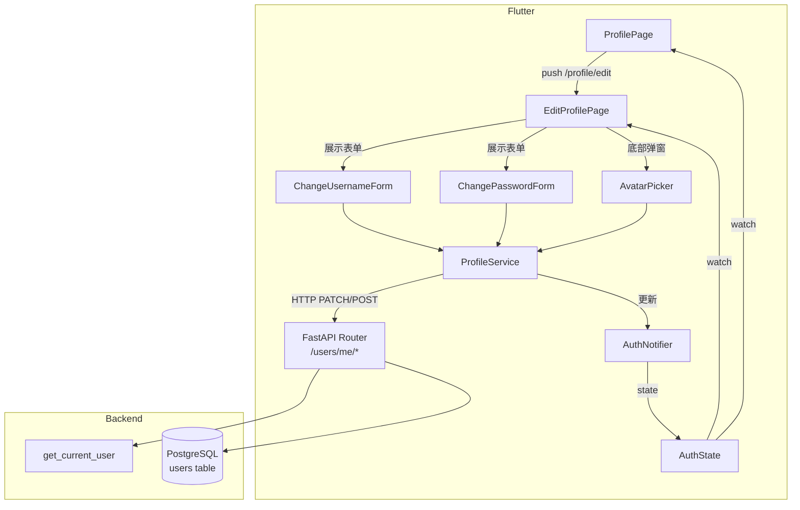

# Design Document: user-profile-edit

## Overview

为学科学习助手 App 新增用户资料编辑功能，允许已登录用户修改用户名、密码和头像。

技术栈：Flutter + Riverpod（前端）、FastAPI + SQLAlchemy + PostgreSQL（后端）。

核心变更：
- 数据库 `users` 表新增 `avatar` TEXT 字段（存储 base64 字符串，可为 NULL）
- 后端新增 `PATCH /users/me/username`、`PATCH /users/me/password`、`POST /users/me/avatar`、`GET /users/me` 四个接口
- Flutter 新增 `EditProfilePage`，挂载在 `/profile/edit` 路由下
- `User` 模型和 `AuthState` 新增 `avatarBase64` 字段
- `ProfilePage` 展示头像并提供"编辑资料"入口

---

## Architecture



**数据流：**
1. 用户在 `EditProfilePage` 操作 → `ProfileService` 发起 HTTP 请求
2. 后端验证 JWT → 操作数据库 → 返回结果
3. `ProfileService` 成功后调用 `AuthNotifier` 更新 `AuthState`
4. Riverpod 响应式更新 `ProfilePage` 和 `EditProfilePage`

---

## Components and Interfaces

### 后端：`backend/routers/users.py`（新建）

```python
router = APIRouter(prefix="/users")

PATCH /users/me/username   # 修改用户名
PATCH /users/me/password   # 修改密码
POST  /users/me/avatar     # 上传头像
GET   /users/me            # 获取当前用户信息（含 avatar）
```

所有接口均依赖 `get_current_user` 注入当前用户。

**请求/响应 Schema：**

```python
class UsernameUpdateIn(BaseModel):
    new_username: str = Field(min_length=1, max_length=64)

class PasswordUpdateIn(BaseModel):
    old_password: str
    new_password: str = Field(min_length=6)

class AvatarUpdateIn(BaseModel):
    avatar_base64: str  # 纯 base64 字符串，不含 data URI 前缀

class UserOut(BaseModel):
    user_id: int
    username: str
    avatar_base64: str | None
```

### Flutter：新增文件

| 文件 | 职责 |
|------|------|
| `lib/features/profile/edit_profile_page.dart` | 编辑资料主页，含用户名/密码入口和头像区域 |
| `lib/features/profile/change_username_form.dart` | 修改用户名表单（内嵌于 EditProfilePage） |
| `lib/features/profile/change_password_form.dart` | 修改密码表单（内嵌于 EditProfilePage） |
| `lib/features/profile/avatar_picker.dart` | 底部弹窗 + image_picker 调用 + 压缩逻辑 |
| `lib/services/profile_service.dart` | 封装所有 `/users/me/*` HTTP 调用 |

### Flutter：修改文件

| 文件 | 变更 |
|------|------|
| `lib/models/user.dart` | 新增 `avatarBase64` 字段 |
| `lib/providers/auth_provider.dart` | `AuthState` 新增 `avatarBase64`；`AuthNotifier` 新增 `updateUsername`、`updateAvatar` 方法 |
| `lib/features/profile/profile_page.dart` | 展示头像（有则显示图片，无则显示首字母）；新增"编辑资料"入口 |
| `lib/routes/app_router.dart` | 新增 `/profile/edit` 路由 |
| `lib/core/constants/api_constants.dart` | 新增 `userMe`、`userMeUsername`、`userMePassword`、`userMeAvatar` 常量 |

---

## Data Models

### 数据库：`users` 表变更

```sql
ALTER TABLE users ADD COLUMN avatar TEXT;  -- base64 字符串，可为 NULL
```

对应 SQLAlchemy ORM 变更：

```python
class User(Base):
    # 现有字段不变
    avatar = Column(Text, nullable=True)
```

### Flutter `User` 模型

```dart
class User {
  final String id;
  final String username;
  final String? avatarBase64;  // 新增

  const User({required this.id, required this.username, this.avatarBase64});
}
```

### Flutter `AuthState`

```dart
class AuthState {
  final User? user;
  final bool isLoading;
  final String? error;
  // avatarBase64 已包含在 User 模型中，通过 user.avatarBase64 访问
}
```

`AuthNotifier` 新增方法：

```dart
void updateUsername(String newUsername);  // 本地更新 user.username
void updateAvatar(String base64);         // 本地更新 user.avatarBase64
```

### 头像存储约定

- 存储格式：纯 base64 字符串（不含 `data:image/jpeg;base64,` 前缀）
- 前端展示时拼接前缀：`data:image/jpeg;base64,$avatarBase64`
- 压缩规格：最大 512×512 像素，JPEG 格式，quality=85
- 大小限制：压缩后不超过 5 MB（前端校验）

---

## Correctness Properties

*A property is a characteristic or behavior that should hold true across all valid executions of a system — essentially, a formal statement about what the system should do. Properties serve as the bridge between human-readable specifications and machine-verifiable correctness guarantees.*

### Property 1: 用户名验证器接受合法长度，拒绝非法长度

*For any* 字符串，若其长度在 1 到 64 之间，用户名验证器应返回 null（通过）；若长度为 0 或超过 64，验证器应返回非 null 的错误信息。

**Validates: Requirements 2.2, 2.3**

### Property 2: 成功修改用户名后 AuthState 同步更新

*For any* 合法用户名字符串，当后端返回 HTTP 200 后，`AuthState.user.username` 应等于该新用户名。

**Validates: Requirements 2.5, 2.8**

### Property 3: 密码验证器——长度与一致性

*For any* 新密码字符串，若长度小于 6，验证器应拒绝；*For any* 两个字符串，若不相等，确认密码验证器应返回"两次输入的密码不一致"错误。

**Validates: Requirements 3.2, 3.3**

### Property 4: 提交有效密码时发送正确的 HTTP 请求

*For any* 合法的（旧密码，新密码）组合，`ProfileService.changePassword` 应向 `PATCH /users/me/password` 发送包含两个字段的请求体，并携带有效 Bearer token。

**Validates: Requirements 3.5**

### Property 5: 后端用户名接口验证长度并更新

*For any* 长度在 1–64 之间的用户名，`PATCH /users/me/username` 应返回 HTTP 200 并在响应体中包含该用户名；*For any* 长度为 0 或超过 64 的用户名，应返回 HTTP 422。

**Validates: Requirements 4.2, 4.5**

### Property 6: 后端密码接口验证旧密码并更新哈希

*For any* 正确的旧密码和长度 ≥ 6 的新密码，`PATCH /users/me/password` 应返回 HTTP 200 并将数据库中的 `password_hash` 更新为新密码的 bcrypt 哈希；*For any* 错误的旧密码，应返回 HTTP 401；*For any* 长度 < 6 的新密码，应返回 HTTP 422。

**Validates: Requirements 5.2, 5.3, 5.4, 5.5**

### Property 7: 头像展示规则

*For any* 用户，若 `avatarBase64` 为非空字符串，`ProfilePage` 应渲染 `Image` 组件；若 `avatarBase64` 为 null 或空，应渲染显示用户名首字母的 `CircleAvatar`。

**Validates: Requirements 6.1**

### Property 8: 图片压缩约束

*For any* 输入图片（任意尺寸），经过压缩处理后，输出图片的宽度和高度均应不超过 512 像素。

**Validates: Requirements 6.5**

### Property 9: 头像上传编码正确性

*For any* 图片字节数组，`ProfileService.uploadAvatar` 应将其编码为 base64 字符串后发送至 `POST /users/me/avatar`，且解码后的字节数组应与原始字节数组相等（round-trip）。

**Validates: Requirements 6.6**

---

## Error Handling

### 前端错误处理

| 场景 | 处理方式 |
|------|----------|
| 用户名为空或超长 | 表单本地验证，不发请求，显示 inline 错误 |
| 密码不一致 / 新密码过短 / 字段为空 | 表单本地验证，不发请求，显示 inline 错误 |
| 图片超过 5 MB | 本地校验，不发请求，显示 SnackBar 错误 |
| HTTP 409（用户名已占用） | 显示"用户名已被占用" |
| HTTP 401（旧密码错误） | 显示"当前密码错误" |
| HTTP 401（token 失效） | 跳转登录页 |
| 其他网络/服务器错误 | 显示"修改失败，请稍后重试" / "头像上传失败，请稍后重试" |
| 请求进行中 | 提交按钮禁用，显示 loading 指示器 |

### 后端错误处理

| 场景 | HTTP 状态码 | 响应体 |
|------|-------------|--------|
| 无效 / 过期 token | 401 | `{"detail": "Token 无效"}` |
| 用户名已被占用 | 409 | `{"detail": "用户名已被占用"}` |
| 旧密码错误 | 401 | `{"detail": "当前密码错误"}` |
| 请求体校验失败 | 422 | FastAPI 默认 ValidationError |
| 数据库异常 | 500 | `{"detail": "服务器内部错误"}` |

---

## Testing Strategy

### 单元测试（Flutter）

使用 `flutter_test` + `mockito` 对以下逻辑进行测试：

- `ChangeUsernameForm` 验证器：合法/非法用户名
- `ChangePasswordForm` 验证器：长度、一致性、空字段
- `ProfileService`：mock Dio，验证请求构造（URL、headers、body）
- `AuthNotifier.updateUsername` / `updateAvatar`：验证状态更新
- `ProfilePage` / `EditProfilePage`：widget 测试，验证 UI 结构和条件渲染

### 属性测试（Flutter）

使用 `dart_test` + `fast_check`（或 `glados`）进行属性测试，每个属性最少运行 100 次：

```
// Feature: user-profile-edit, Property 1: 用户名验证器接受合法长度，拒绝非法长度
// Feature: user-profile-edit, Property 2: 成功修改用户名后 AuthState 同步更新
// Feature: user-profile-edit, Property 3: 密码验证器——长度与一致性
// Feature: user-profile-edit, Property 4: 提交有效密码时发送正确的 HTTP 请求
// Feature: user-profile-edit, Property 7: 头像展示规则
// Feature: user-profile-edit, Property 8: 图片压缩约束
// Feature: user-profile-edit, Property 9: 头像上传编码正确性
```

### 单元测试（后端）

使用 `pytest` + `httpx.AsyncClient` + SQLite 内存数据库：

- `PATCH /users/me/username`：合法用户名 → 200；重复用户名 → 409；非法长度 → 422；无 token → 401
- `PATCH /users/me/password`：正确旧密码 → 200；错误旧密码 → 401；新密码过短 → 422
- `POST /users/me/avatar`：合法 base64 → 200；无 token → 401
- `GET /users/me`：返回含 avatar 的用户信息

### 属性测试（后端）

使用 `hypothesis` 进行属性测试，每个属性最少运行 100 次：

```
# Feature: user-profile-edit, Property 5: 后端用户名接口验证长度并更新
# Feature: user-profile-edit, Property 6: 后端密码接口验证旧密码并更新哈希
```

### 集成测试

- 完整流程：登录 → 修改用户名 → 验证 ProfilePage 显示新用户名
- 完整流程：登录 → 上传头像 → 验证 ProfilePage 显示头像图片
- 完整流程：登录 → 修改密码 → 用新密码重新登录成功
