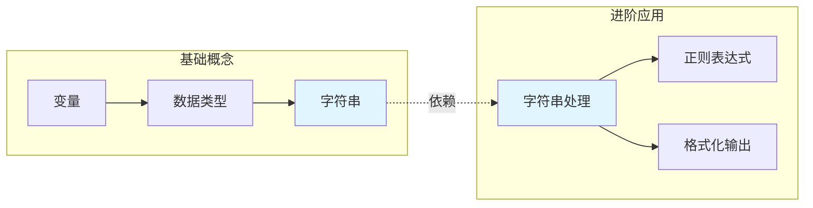
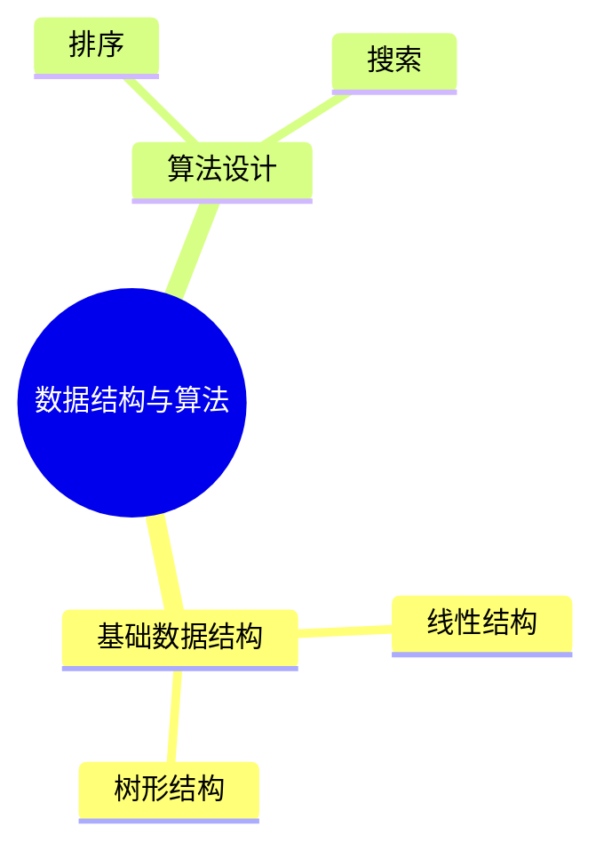
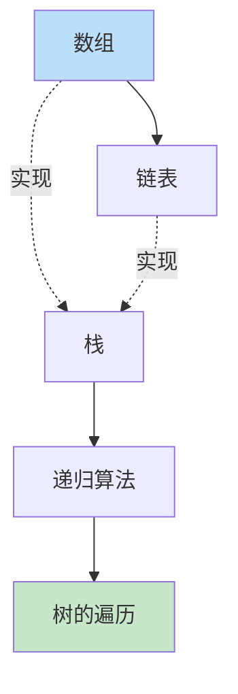

# Book Mindmap - 书籍思维导图生成器

## Overview

This skill transforms electronic books into structured Mermaid mind maps with runnable demonstration code for key concepts. It supports PDF, EPUB, DOCX, and TXT formats, extracting chapters, core concepts, and key knowledge points to produce comprehensive visual knowledge graphs.

## Trigger Phrases (触发词)

This skill triggers when users mention any of the following:

| 触发词类型 | 示例短语 |
|-----------|---------|
| 直接命令 | "生成思维导图"、"创建知识图谱"、"提取书本结构" |
| 文件操作 | "帮我分析这本书"、"把 PDF 转成导图" |
| 学习辅助 | "整理读书笔记"、"总结书的内容"、"梳理知识点" |
| 英文表达 | "convert to mindmap", "create mind map from book", "book summary" |

**关键触发条件：**
- 用户提供了电子书文件（.pdf, .epub, .docx, .txt）
- 用户请求生成思维导图或知识结构
- 用户需要整理书籍内容或读书笔记

## Workflow Decision Tree

```
┌─────────────────────────────────────────────────────────────┐
│                    收到电子书文件                            │
└─────────────────────────────────────────────────────────────┘
                            │
                            ▼
┌─────────────────────────────────────────────────────────────┐
│ Step 1: 识别文件格式                                         │
│ • PDF → 使用 pdf skill 或 pdfplumber 提取文本               │
│ • EPUB → 使用 ebooklib 提取内容                             │
│ • DOCX → 使用 python-docx 提取段落                          │
│ • TXT → 直接读取文本内容                                     │
└─────────────────────────────────────────────────────────────┘
                            │
                            ▼
┌─────────────────────────────────────────────────────────────┐
│ Step 2: 多层级结构挖掘 ⭐ 核心升级                           │
│                                                             │
│  第1级：显式结构（目录/书签/标题样式）                       │
│    ↓ 目录可能只有2层，但正文有4-5层                          │
│  第2级：隐式小标题（编号/加粗/短行+冒号）                   │
│    ↓ 正文中未列入目录但实际存在的标题                        │
│  第3级：语义知识点（定义句/分类句/公式引导句）               │
│    ↓ 完全没有标记但语义上独立的知识点                        │
│                                                             │
│  → 三级合并 → 完整知识树（4-5层）                           │
└─────────────────────────────────────────────────────────────┘
                            │
                            ▼
┌─────────────────────────────────────────────────────────────┐
│ Step 3: 知识点提取                                           │
│ • 每个章节提取 3-5 个核心概念                                │
│ • 识别概念定义和关键论点                                     │
│ • 应用知识关联分析（共现、引用、因果）                       │
└─────────────────────────────────────────────────────────────┘
                            │
                            ▼
┌─────────────────────────────────────────────────────────────┐
│ Step 4: 知识关联发现                                         │
│ • 检测跨章节的概念联系                                       │
│ • 识别因果关系、对比关系、依赖关系                           │
│ • 构建概念网络而非单一树形结构                               │
└─────────────────────────────────────────────────────────────┘
                            │
                            ▼
┌─────────────────────────────────────────────────────────────┐
│ Step 5: 生成精细化思维导图                                   │
│ • 应用 MECE 原则确保结构完整                                 │
│ • 动态深度：教材4-5层 / 技术书3-4层 / 文学2-3层             │
│ • 大书自动拆分为：总览图 + 各章详图 + 跨章关联图            │
│ • 应用颜色编码标识知识点性质                                 │
└─────────────────────────────────────────────────────────────┘
                            │
                            ▼
┌─────────────────────────────────────────────────────────────┐
│ Step 6: 生成演示代码（可选）                                  │
│ • 为编程类书籍的关键概念生成示例代码                         │
│ • 为方法论类书籍生成可执行的演示脚本                         │
│ • 确保代码可运行并配有注释                                   │
└─────────────────────────────────────────────────────────────┘
```

## Step 1: 文件格式处理

### PDF 文件处理

Use the pdf skill for PDF files, or use Python pdfplumber:

```python
import pdfplumber

def extract_pdf_content(pdf_path):
    content = []
    with pdfplumber.open(pdf_path) as pdf:
        for page in pdf.pages:
            text = page.extract_text()
            if text:
                content.append(text)
    return "\n".join(content)
```

### EPUB 文件处理

```python
from ebooklib import epub

def extract_epub_content(epub_path):
    book = epub.read_epub(epub_path)
    content = []
    for item in book.get_items():
        if item.get_type() == 9:  # ITEM_DOCUMENT
            content.append(item.get_content().decode('utf-8'))
    return "\n".join(content)
```

### DOCX 文件处理

```python
from docx import Document

def extract_docx_content(docx_path):
    doc = Document(docx_path)
    content = [para.text for para in doc.paragraphs if para.text.strip()]
    return "\n".join(content)
```

### TXT 文件处理

```python
def extract_txt_content(txt_path):
    with open(txt_path, 'r', encoding='utf-8') as f:
        return f.read()
```

## Step 2: 多层级结构挖掘 ⭐ 核心升级

### 问题：目录层级 ≠ 知识层级

很多书籍**目录只有二级**（如"第1章""1.1"），但正文中实际隐藏了三、四级知识点。仅靠目录识别会导致思维导图严重"扁平化"。

```
❌ 仅看目录（只有2层，信息丢失严重）：
第2章 轴向拉伸与压缩
  2.1 轴力与轴力图

✅ 深入内容后（4层，知识完整）：
第2章 轴向拉伸与压缩
  2.1 轴力与轴力图
    轴力的正负规定          ← 正文小标题
      拉力为正/压力为负     ← 知识细节
```

### 三级挖掘策略

#### 第1级：显式结构提取（目录 + 标题样式）

**从排版信息获取最可靠的层级**：

| 信号来源 | 识别方式 | 可靠度 |
|---------|---------|--------|
| 目录页 | 直接提取目录层级 | ⭐⭐⭐⭐⭐ |
| PDF 书签 | 提取 PDF 内嵌书签 | ⭐⭐⭐⭐⭐ |
| DOCX 标题样式 | Heading1/2/3/4 | ⭐⭐⭐⭐⭐ |
| EPUB NCX/Nav | 提取导航目录 | ⭐⭐⭐⭐ |
| 字号/加粗推断 | 大号加粗=高层级标题 | ⭐⭐⭐ |
| 编号格式推断 | 1.→1.1→1.1.1 | ⭐⭐⭐⭐ |

```python
# PDF 书签提取
def extract_pdf_bookmarks(pdf_path):
    """提取 PDF 内嵌书签，获得最准确的层级"""
    import pdfplumber
    with pdfplumber.open(pdf_path) as pdf:
        # 尝试获取大纲/书签
        outline = pdf_outline.get(pdf_path, [])
        return parse_outline_to_tree(outline)

# DOCX 标题样式提取
def extract_docx_headings(docx_path):
    """从 DOCX 标题样式获取完整层级"""
    from docx import Document
    doc = Document(docx_path)
    hierarchy = []
    for para in doc.paragraphs:
        if para.style.name.startswith('Heading'):
            level = int(para.style.name.replace('Heading ', ''))
            hierarchy.append({'level': level, 'text': para.text})
    return hierarchy
```

#### 第2级：隐式小标题推断（正文中的段落级标题）

**正文中存在大量未列入目录的小标题**，需要通过模式匹配识别：

| 模式类型 | 正则表达式 | 示例 |
|---------|-----------|------|
| 数字编号 | `^\d+\.\d+(\.\d+)*` | "2.3.1 应力集中" |
| 中文编号 | `^[（(][一二三四五六七八九十]+[）)]` | "（一）基本假设" |
| 加粗行首 | `^\*\*.+\*\*$` | "**胡克定律的适用条件**" |
| 定义引导 | `^.+[是指为]：` | "应力集中是指：" |
| 短行+冒号 | `^.{2,15}[：:]$` | "主应力：" |
| 列表标题 | `^[一二三四五六七八九十]+[、.]` | "一、弹性阶段" |

```python
# 隐式小标题检测
HEADING_PATTERNS = [
    # 编号式
    (r'^(\d+\.\d+(?:\.\d+)*)\s+(.+)', 'numbered'),        # 2.3.1 标题
    (r'^[（(]([一二三四五六七八九十]+)[）)]\s*(.+)', 'cn_numbered'),  # （三）标题
    # 格式式
    (r'^\*\*(.+?)\*\*\s*$', 'bold'),                       # **加粗标题**
    (r'^(.{2,15})[：:]\s*$', 'colon'),                     # 短标题：
    # 定义式
    (r'^(.{2,12})是指\s*$', 'definition'),                 # X是指
    (r'^(.{2,12})的定义[：:]', 'definition'),              # X的定义：
    # 列表式
    (r'^([一二三四五六七八九十]+)[、.]\s*(.+)', 'list_item'), # 一、标题
]

def detect_implicit_headings(text: str) -> list:
    """从正文中检测隐式小标题"""
    headings = []
    for line in text.split('\n'):
        line = line.strip()
        if not line or len(line) > 50:
            continue
        for pattern, ptype in HEADING_PATTERNS:
            match = re.match(pattern, line)
            if match:
                headings.append({
                    'text': line,
                    'type': ptype,
                    'raw': match.group(0)
                })
                break
    return headings
```

#### 第3级：语义知识点推断（AI 深度分析）

**当正文既无小标题、也无编号时**，需要通过语义理解提取知识点：

```python
# 语义级知识点提取规则
SEMANTIC_PATTERNS = {
    # 定义型
    'definition': [
        r'(.{2,15})是指(.{5,})',
        r'(.{2,15})定义为(.{5,})',
        r'所谓(.{2,15})[，,]是指(.{5,})',
        r'称(.{2,15})为(.{5,})',
    ],
    # 分类/列举型
    'classification': [
        r'(.{2,10})分为以下几种[：:](.{10,})',
        r'(.{2,10})包括[：:](.{10,})',
        r'(.{2,10})有以下[三两几]种[：:](.{10,})',
    ],
    # 公式型
    'formula': [
        r'(.{2,15})的计算公式[为：:]',
        r'(.{2,15})公式[为：:]',
        r'(.{2,10})可由下式计算',
    ],
    # 对比型
    'comparison': [
        r'(.{2,10})与(.{2,10})的区别',
        r'(.{2,10})和(.{2,10})不同',
    ],
    # 条件/适用型
    'condition': [
        r'(.{2,15})的适用条件[为：:]',
        r'(.{2,15})适用于(.{5,})',
        r'当(.{5,})时[，,](.{2,15})',
    ],
}
```

### 层级深度决定规则

| 书籍类型 | 建议深度 | 决策依据 |
|---------|---------|---------|
| 教材/考试类 | **4-5 层** | 需要覆盖到考点细节 |
| 技术/编程类 | **3-4 层** | 重点在概念和用法 |
| 文学/社科类 | **2-3 层** | 侧重脉络和人物关系 |
| 手册/工具书 | **3-4 层** | 按功能模块组织 |

**动态深度调整**：

```python
def determine_max_depth(content: str, book_type: str) -> int:
    """根据内容特征动态决定最大层级深度"""

    # 基础深度
    base_depth = {
        'textbook': 5,   # 教材
        'technical': 4,  # 技术书
        'literature': 3, # 文学
        'manual': 4,     # 手册
    }

    depth = base_depth.get(book_type, 4)

    # 内容越丰富，层级越深
    char_count = len(content)
    if char_count > 200000:   # 超过20万字
        depth += 1
    elif char_count < 30000:  # 不足3万字
        depth -= 1

    # 显式层级越多，深度越大
    numbered_headings = len(re.findall(r'\d+\.\d+', content))
    if numbered_headings > 50:
        depth = max(depth, 5)

    return min(depth, 5)  # 上限5层（Mermaid渲染限制）
```

### 层级组装算法

将三级挖掘结果组装为完整的知识树：

```
┌──────────────────────────────────────────────────────────┐
│                  三级挖掘结果合并                          │
│                                                          │
│  第1级（显式）    第2级（隐式）    第3级（语义）           │
│  ┌─────────┐    ┌─────────┐    ┌─────────┐             │
│  │ 目录结构 │    │ 小标题  │    │ 知识点  │             │
│  │ 2层     │ +  │ 3-4层   │ +  │ 4-5层   │ = 完整知识树│
│  └─────────┘    └─────────┘    └─────────┘   4-5层      │
└──────────────────────────────────────────────────────────┘
```

**合并规则**：

1. **显式结构优先**：目录/书签中的层级直接采用
2. **隐式结构归位**：小标题归入最近的上层显式标题下
3. **语义结构兜底**：知识点归入最近的隐式/显式标题下
4. **去重过滤**：同一内容在不同级别出现时，保留最详细版本

```python
def build_knowledge_tree(explicit, implicit, semantic):
    """组装完整知识树"""

    tree = {}

    # 第1步：以显式结构为骨架
    for item in explicit:
        tree[item['id']] = {
            'text': item['text'],
            'level': item['level'],
            'source': 'explicit',
            'children': []
        }

    # 第2步：将隐式小标题挂载到骨架上
    for item in implicit:
        parent = find_nearest_parent(tree, item)
        if parent:
            tree[parent['id']]['children'].append({
                'text': item['text'],
                'level': parent['level'] + 1,
                'source': 'implicit',
                'children': []
            })

    # 第3步：将语义知识点挂载到小标题下
    for item in semantic:
        parent = find_nearest_parent(tree, item)
        if parent:
            tree[parent['id']]['children'].append({
                'text': item['text'],
                'level': parent['level'] + 1,
                'source': 'semantic',
                'children': []
            })

    return tree
```

### 章节识别模式

书籍通常遵循以下结构模式：

| 模式类型 | 识别规则 | 示例 |
|---------|---------|------|
| 数字编号 | `第\d+章\|Chapter\s+\d+` | "第1章 入门", "Chapter 1" |
| 部分编号 | `第[一二三四五六七八九十]+部分\|Part\s+\d+` | "第一部分 基础" |
| 层级标题 | `^\d+\.\d+` | "1.1 概述", "2.3.4 实现" |
| 特殊标记 | `^\s*[●•◆◇○◎]` | "● 核心概念" |

### 结构提取逻辑

1. **扫描全文** - 识别所有可能的章节标题
2. **建立层级** - 根据编号规则确定父子关系
3. **提取内容** - 将正文分配到对应章节
4. **深度挖掘** - 对每个章节执行隐式标题和语义知识点提取
5. **验证结构** - 确保层级逻辑正确

## Step 3: 知识点提取

### 核心概念识别

对每个章节执行以下操作：

1. **提取关键词** - 使用词频分析识别核心术语
2. **识别定义句** - 匹配 "X是指...", "X定义为...", "所谓X..." 模式
3. **提取论点** - 识别 "因此...", "综上...", "核心观点..." 等引导句
4. **发现关联** - 识别概念之间的引用和依赖关系

### 知识点组织原则

```
书籍（L1）
├── 第一部分/Part 1（L2）
│   ├── 第1章/Chapter 1（L3）
│   │   ├── 1.1 小节（L4 - 显式/隐式）
│   │   │   ├── 核心概念 A（L5 - 隐式/语义）
│   │   │   │   ├── 定义
│   │   │   │   ├── 特点
│   │   │   │   └── 示例
│   │   │   └── 核心概念 B
│   │   └── 1.2 小节
│   └── 第2章/Chapter 2
└── 第二部分/Part 2
```

### 不同书籍的典型层级结构

| 书籍类型 | L1 | L2 | L3 | L4 | L5 |
|---------|----|----|----|----|-----|
| 教材（如材料力学） | 书名 | 部分 | 章 | 节(1.1) | 知识点 |
| 编程书（如Python入门） | 书名 | 篇 | 章 | 小节 | 语法/示例 |
| 文学书（如红楼梦） | 书名 | — | 回 | 人物线 | 情节节点 |
| 科普书（如时间简史） | 书名 | — | 章 | 核心概念 | 论证逻辑 |

---

## Step 4: 知识关联发现 ⭐ 核心升级

### 理论基础：概念图理论 (Concept Mapping)

基于 Joseph Novak 的概念图理论，知识不仅存在于层级结构中，更以**命题 (Propositions)** 的形式相互关联：

```
概念 A ──[关系]──► 概念 B
```

### 四种知识关联类型

| 关联类型 | 识别模式 | 示例 |
|---------|---------|------|
| **因果关系** | "因此", "导致", "造成", "使得" | 变量作用域 → 内存泄漏 |
| **对比关系** | "相反", "不同", "区别于", "与之相对" | 同步编程 vs 异步编程 |
| **依赖关系** | "基于", "依赖于", "建立在", "需要先" | 函数定义 → 函数调用 |
| **演进关系** | "发展出", "演变为", "升级为" | Web 1.0 → Web 2.0 → Web 3.0 |

### 关联发现算法

#### 1. 共现分析 (Co-occurrence Analysis)

识别在同一上下文（段落、章节）中反复出现的概念对：

```
段落中出现: [列表, 栈, 队列, 数组]
发现关联: 列表-栈 (同为线性结构), 列表-数组 (实现关系)
```

#### 2. 语言模式匹配

```python
# 因果关系模式
causal_patterns = [
    r'(.+?)因此(.+)',
    r'(.+?)导致(.+)',
    r'(.+?)使得(.+)',
    r'(.+?)造成了(.+)',
]

# 对比关系模式
contrast_patterns = [
    r'(.+?)与(.+?)不同',
    r'(.+?)和(.+?)的区别',
    r'(.+?)相反，(.+)',
    r'与之相对，(.+?)是(.+)',
]

# 依赖关系模式
dependency_patterns = [
    r'(.+?)建立在(.+?)基础上',
    r'(.+?)依赖于(.+)',
    r'(.+?)需要先(.+)',
    r'(.+?)的基础是(.+)',
]
```

#### 3. 引用识别

检测书中显式的概念引用：

```
"如第3章所述..."
"前面提到的 X..."
"这被称为 Y..."
"详见 Z 节..."
```

### 关联强度评估

| 强度 | 特征 | 处理方式 |
|-----|------|---------|
| 强关联 | 明确的因果、依赖陈述 | 必须在导图中体现 |
| 中关联 | 共现频率高，同一上下文 | 用虚线或注释标注 |
| 弱关联 | 概念相似或有类比关系 | 在说明文字中提及 |

---

## Step 5: 精细化思维导图生成 ⭐ 核心升级

### 设计原则

#### 1. MECE 原则 (Mutually Exclusive, Collectively Exhaustive)

确保知识分类：
- **相互独立**：同级概念不重叠
- **完全穷尽**：覆盖该主题所有重要方面

```
✅ 正确示例：
数据结构
├── 线性结构
│   ├── 数组
│   ├── 链表
│   ├── 栈
│   └── 队列
└── 非线性结构
    ├── 树
    └── 图

❌ 错误示例：
数据结构
├── 数组        （层级混乱）
├── 树          （缺少中间分类）
└── 链表和栈    （概念重叠）
```

#### 2. 金字塔原理 (Pyramid Principle)

- **结论先行**：根节点概括主题
- **以上统下**：上层概念涵盖下层
- **归类分组**：同质概念归为一组
- **逻辑递进**：按时间、结构或重要性排序

#### 3. 认知负荷理论 (Cognitive Load Theory)

优化信息呈现以降低认知负担：

| 原则 | 具体做法 |
|-----|---------|
| 分块呈现 | 每个分支不超过 7 个子节点 |
| 渐进展开 | 先展示主干，再展开细节 |
| 双重编码 | 图形 + 文字同时呈现 |
| 减少冗余 | 避免重复信息 |

### 交叉连接的呈现

对于跨分支的概念关联，使用 Mermaid 的 graph 语法展示：



### 视觉设计原则

#### 色彩编码系统

**1. 层级颜色**（用于区分知识层级）

| 层级 | 推荐颜色 | 用途 |
|-----|---------|------|
| 根节点 | 深蓝 `#1a237e` | 书籍主题 |
| 第一层 | 主蓝 `#1976d2` | 部分/篇 |
| 第二层 | 浅蓝 `#42a5f5` | 章节 |
| 第三层 | 淡蓝 `#90caf9` | 核心概念 |
| 第四层 | 极淡蓝 `#e3f2fd` | 细节要点 |

**2. 知识点性质颜色** ⭐ 核心功能

用不同颜色标识知识点的学习属性，让读者一目了然：

| 知识性质 | 颜色 | 色值 | 视觉效果 | 识别依据 |
|---------|------|------|---------|---------|
| 🔴 **重点** | 红色系 | `#ffcdd2` / `#e53935` | 红色背景 + 加粗边框 | "重点"、"核心"、"关键"、"必须掌握" |
| 🟠 **难点** | 橙色系 | `#ffe0b2` / `#fb8c00` | 橙色背景 + 虚线边框 | "难点"、"复杂"、"容易混淆"、"深入理解" |
| 🟡 **易错点** | 黄色系 | `#fff9c4` / `#fdd835` | 黄色背景 + 警示图标 | "注意"、"易错"、"陷阱"、"常见错误" |
| 🟢 **基础** | 绿色系 | `#c8e6c9` / `#43a047` | 绿色背景 + 浅边框 | "基础"、"入门"、"前提"、"前置知识" |
| 🔵 **拓展** | 蓝色系 | `#bbdefb` / `#1e88e5` | 蓝色背景 + 斜体 | "拓展"、"延伸"、"进阶"、"了解更多" |
| 🟣 **考点** | 紫色系 | `#e1bee7` / `#8e24aa` | 紫色背景 + 星标 | "考点"、"常考"、"必考"、"面试题" |
| ⚪ **普通** | 灰色系 | `#f5f5f5` / `#757575` | 默认样式 | 无特殊标记的常规知识点 |

**颜色应用示例**：

```mermaid
mindmap
  root((数据结构))
    线性结构
      数组:::basic
      链表:::basic
      栈:::keypoint
      队列:::keypoint
    非线性结构
      树
        二叉树:::difficult
        B树:::extension
        红黑树:::difficult
      图:::difficult
    排序算法
      冒泡排序:::basic
      快速排序:::keypoint
      堆排序:::difficult
      基数排序:::errorpoint

classDef keypoint fill:#ffcdd2,stroke:#e53935,stroke-width:3px
classDef difficult fill:#ffe0b2,stroke:#fb8c00,stroke-width:2px,stroke-dasharray: 5 5
classDef errorpoint fill:#fff9c4,stroke:#fdd835,stroke-width:2px
classDef basic fill:#c8e6c9,stroke:#43a047,stroke-width:1px
classDef extension fill:#bbdefb,stroke:#1e88e5,stroke-width:1px,font-style:italic
```

**知识点性质识别模式**：

```python
KNOWLEDGE_TYPE_PATTERNS = {
    'keypoint': [      # 重点
        r'重点[：:]',
        r'核心[概念]?[：:]',
        r'关键[是]?[：:]',
        r'必须掌握',
        r'重要',
        r'★+',
    ],
    'difficult': [     # 难点
        r'难点[：:]',
        r'复杂',
        r'容易混淆',
        r'深入理解',
        r'难度较高',
        r'进阶内容',
    ],
    'errorpoint': [    # 易错点
        r'注意[：:]',
        r'易错',
        r'陷阱',
        r'常见错误',
        r'误区',
        r'踩坑',
        r'⚠️',
    ],
    'basic': [         # 基础
        r'基础[：:]',
        r'入门',
        r'前提',
        r'前置知识',
        r'基本概念',
    ],
    'extension': [     # 拓展
        r'拓展[：:]',
        r'延伸',
        r'进阶',
        r'了解更多',
        r'推荐阅读',
        r'扩展',
    ],
    'exam': [          # 考点
        r'考点[：:]',
        r'常考',
        r'必考',
        r'面试题',
        r'真题',
    ],
}
```

**输出时生成图例**：

每个思维导图应附带颜色图例说明：

```markdown
## 📊 颜色图例

| 颜色 | 含义 | 示例知识点 |
|-----|------|-----------|
| 🔴 红色 | 重点掌握 | 栈、快速排序 |
| 🟠 橙色 | 难点理解 | 红黑树、动态规划 |
| 🟡 黄色 | 易错警示 | 指针释放、递归终止条件 |
| 🟢 绿色 | 基础概念 | 数组、变量 |
| 🔵 蓝色 | 拓展延伸 | B树、一致性哈希 |
| 🟣 紫色 | 考试重点 | 时间复杂度分析 |
```

#### 图标系统

```
📚 书籍/文献     📖 章节         📝 笔记要点
💡 核心概念     ⚡ 关键技巧     ⚠️ 注意事项
🔗 关联引用     ❓ 疑问待解     ✅ 已掌握
🔧 工具/方法    🎯 目标         📌 重点标记
🔄 对比关系     ➡️ 因果关系     ↔️ 双向关联
```

### Mermaid 高级语法

#### 样式定义

```mermaid
mindmap
  root((📚 书名))
    第一部分
      第1章 基础概念
        变量
          :::highlight
        数据类型
      第2章 进阶应用
        函数
          :::important
    第二部分
      第3章 实战
        项目1
          :::practical

classDef highlight fill:#fff3e0,stroke:#ff9800,stroke-width:2px
classDef important fill:#e3f2fd,stroke:#1976d2,stroke-width:2px
classDef practical fill:#e8f5e9,stroke:#4caf50,stroke-width:2px
```

#### 混合视图（思维导图 + 关联图）

对于复杂书籍，同时输出两种视图：

**视图1：层级思维导图** - 展示书籍结构


**视图2：知识关联图** - 展示概念联系


### 导图生成规则

| 规则 | 说明 |
|-----|------|
| 层级深度 | **动态决定**：教材4-5层，技术书3-4层，文学2-3层 |
| 深度来源 | 显式目录 + 隐式小标题 + 语义推断，三级合并 |
| 节点文字 | 每个节点不超过 15 个字符 |
| 核心概念 | 每章节提取 3-5 个核心概念 |
| 交叉连接 | 每个导图标注 3-5 个关键关联 |
| 图标使用 | 适度使用 emoji 增强可读性 |
| 颜色编码 | 为不同层级使用不同颜色 |

### 大书分页输出策略

当知识树超过 Mermaid 渲染上限时，自动按章节拆分为多张导图：

```python
def should_split(tree, max_nodes=50):
    """判断是否需要拆分导图"""
    total_nodes = count_nodes(tree)
    return total_nodes > max_nodes

def split_by_chapter(tree):
    """按章节拆分为多张导图"""
    chapters = []
    for chapter in tree['children']:
        chapter_map = build_sub_mindmap(chapter)
        chapters.append({
            'title': chapter['text'],
            'mindmap': chapter_map,
            'relation_map': build_cross_chapter_links(chapter)
        })
    return chapters
```

输出结构：
```
📊 总览导图（1-2层，展示全书框架）
📊 第1章 导图（3-5层，深入细节）
📊 第2章 导图（3-5层，深入细节）
...
🔗 跨章关联图（展示章间联系）
```

---

## Step 6: 演示代码生成

### 编程类书籍

为关键概念生成可运行的 Python 示例：

```python
# 示例：为《Python 数据分析》生成的演示代码
# 概念：DataFrame 基本操作

import pandas as pd

def demonstrate_dataframe():
    """演示 DataFrame 的基本操作"""
    # 创建 DataFrame
    df = pd.DataFrame({
        'name': ['Alice', 'Bob', 'Charlie'],
        'age': [25, 30, 35],
        'city': ['Beijing', 'Shanghai', 'Guangzhou']
    })

    # 基本操作
    print("数据概览:")
    print(df.head())

    print("\n统计信息:")
    print(df.describe())

    return df

if __name__ == "__main__":
    demonstrate_dataframe()
```

### 方法论类书籍

生成可执行的演示脚本：

```python
# 示例：为《精益创业》生成的演示代码
# 概念：MVP (最小可行产品) 验证流程

class MVPValidator:
    """MVP 验证流程演示"""

    def __init__(self, hypothesis: str):
        self.hypothesis = hypothesis
        self.metrics = []

    def define_metrics(self, metrics: list):
        """定义验证指标"""
        self.metrics = metrics
        print(f"假设: {self.hypothesis}")
        print(f"验证指标: {', '.join(metrics)}")

    def run_experiment(self, duration_days: int):
        """运行实验"""
        print(f"\n实验周期: {duration_days} 天")
        print("收集数据中...")

    def analyze_results(self, data: dict):
        """分析结果"""
        print("\n实验结果:")
        for metric, value in data.items():
            print(f"  {metric}: {value}")

if __name__ == "__main__":
    validator = MVPValidator("用户愿意为功能 X 付费")
    validator.define_metrics(["转化率", "付费意愿", "留存率"])
    validator.run_experiment(14)
    validator.analyze_results({"转化率": "15%", "付费意愿": "8%"})
```

---

## Output Format

最终输出应包含以下内容：

### 1. 书籍信息摘要

```markdown
## 📚 书籍信息

- **书名**：XXX
- **格式**：PDF/EPUB/DOCX/TXT
- **总章节**：X 章
- **核心概念**：X 个
- **知识关联**：X 对
```

### 2. 层级思维导图

完整的 Mermaid mindmap 代码块，展示书籍结构。

### 3. 知识关联图

使用 Mermaid graph 展示跨章节的概念联系。

### 4. 关联说明

列出发现的关键关联及其类型：

```markdown
## 🔗 知识关联

| 概念 A | 关联类型 | 概念 B | 依据 |
|--------|---------|--------|------|
| 函数定义 | 依赖 | 变量声明 | 第3章明确指出"函数操作变量" |
| 栈 | 对比 | 队列 | 第5章对比两者的出入规则 |
| 递归 | 因果 | 栈溢出 | 第7章分析内存消耗导致的问题 |
```

### 5. 知识点详解

每个核心概念的详细说明，包括定义、特点、应用场景。

### 6. 演示代码

为关键概念生成的可运行示例代码（如适用）。

---

## Example Usage

**用户输入：**
> 帮我把《Python 编程：从入门到实践》这本书生成思维导图

**执行流程：**
1. 识别文件格式（假设为 PDF）
2. 提取章节结构（共 20 章，分 3 部分）
3. 分析每个章节的核心概念
4. **发现跨章节关联**（如：变量→数据类型→字符串处理）
5. 生成 Mermaid mindmap + 关联图
6. 为关键编程概念生成演示代码

**输出预览：**
- 层级思维导图展示书籍完整结构
- 知识关联图展示概念之间的联系
- 关联说明表列出发现的关联
- 关键概念的 Python 示例代码

---

## Notes

- 对于超过 500 页的大部头书籍，建议按部分分别生成导图
- 如果书籍包含大量代码，优先提取代码片段作为示例
- 对于文学类书籍，重点提取人物关系、情节脉络
- 对于教材类书籍，重点提取知识体系和考点
- **复杂书籍建议生成两张图**：层级导图 + 关联图
- **交叉连接数量**：控制在每图 5-10 个，避免视觉混乱
